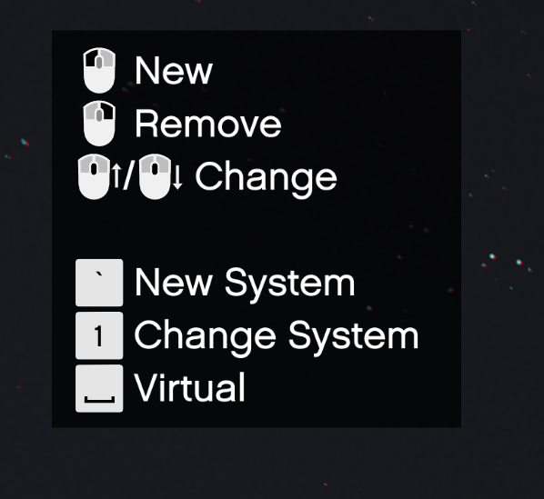

# Tool

This page explains how to create/edit alarm systems with the FAR Tool.

The FAR Tool is a powerful in-game feature that allows server owners to create new and edit existing fire alarm systems directly from their server.

When using the FAR Tool, drafts are saved directly to the server's files, so server owners can delegate creation of alarm systems to trusted players without having the worry about the hassle of needing to send each other files.

Watch the [YouTube Video](https://www.youtube.com/watch?v=m89Kc5o5HpE&t=993s) for FAR Tool.

:::tip
You must be in first-person to use the FAR Tool.
:::

## First-Time Use

The very first time the FAR Tool is used on your server, it will create a new directory in the root of your server files, this is *generally* the same location as your `resources` folder and `server.cfg` file, see the example below:


If you are ever unsure, you can use the `/firealarm path` command from your server console, it will tell you exactly where the directory is located.

## Drafts

### Creating a new Draft

To create a new draft, use the `/firealarm tool new` command.

### Editing an existing Draft

To edit an existing draft, use the `/firealarm tool` command, then make a selection from the list.

:::note
If a new draft is created automatically, then there are no drafts in your draft's directory.
:::

### Saving a Draft

If you created a new draft, you will need to give the draft a name, do this by using the `/firealarm tool <draft_name_here>` command (`<>` not required).

If you are editing an existing draft, you only need to type `/firealarm tool`.

### Discarding a Draft

If you wish to *not* save changes to a draft, you can use the `/firealarm tool cancel` command.

:::danger
This will immediately and irreversibly discard the changes you have made, and you cannot get them back.
:::

### Deploying a Draft

To deploy a draft as an Alarm System, you will need to copy the file from the Drafts folder and place it inside another FiveM resource.  
Most people find it easiest to place it inside the [`inferno-alarms` resource](../install.md#optional---install-pre-created-locations), but you can place it inside any resource, so long as the manifest file is updated.

In your resource of choice, add this line at the bottom of the `fxmanifest.lua`:

```lua
fire_alarms "your_draft_name_here.lua"
```

:::note
Drafts cannot be placed in the Fire Alarm Reborn resource.
:::

Making sure to replace `your_draft_name_here` with the name of the draft `.lua` file.

Below is an example of a full `fxmanifest.lua`:
```lua showLineNumbers
fx_version "cerulean"
game "gta5"

fire_alarms "mission_row.lua"

dependency "inferno-fire-alarm-reborn"
```

:::tip
Resources with Draft Alarm Systems inside them must be started *after* Fire Alarm Reborn, or they will not be loaded.  
Either add `dependency "inferno-fire-alarm-reborn"` to the manifest, or update your resource start order.
:::

## In-Game Tool

### Controls 

Below you will find the controls for the FAR Tool. They will also display in the top left of your screen.



In addition to the above, there are the following:

#### Arrow Keys
The Left and Right arrow keys will rotate the current prop left or right.  
The Up and Down arrow keys will move the current prop closer or further away from you.

:::tip
Holding Left Shift will increase the increment of the above changes.
:::

#### Left Mouse Button

If the bottom of your screen starts with `Place a`, then this will create a new prop of the type you have selected.

If it says `Hide a Prop`, then this will hide the prop highlighted in orange. [See here](#hidden-props).

:::tip
When looking at a previously placed prop (will have a white circle around it), you can Left-Click to move it to a new location.
:::

#### Right Mouse Button

If the bottom of your screen starts with `Place a`, then this will delete the selected prop.

If it says `Hide a Prop`, then this will unhide the selected prop.

#### Scroll Wheel

This changes between all the prop types, as well as the `Hide a Prop` option.

#### Tilda ( ` )

This creates a new fire Alarm System. When creating a system, you need to be roughly at the center or middle of the building you are using, as your current location is saved.

:::tip
You can have multiple fire alarm systems in a single draft. For example, in the pre-created locations, all clothing stores are inside the same draft file.
:::

#### 1 (One)

This cycles through created alarm systems inside this draft file.

:::warning
If you see the warning below at the bottom of your screen, you are too far from the centre location of your Alarm System.


:::

#### Space Bar

This will toggle prop being Virtual or not. [See here](#virtual-props).

### Hidden Props

When a prop is hidden with the FAR Tool, it will not appear in-game. The intention is to allow server owners to remove props that conflict with FAR and replace them with FAR props.

For example, if you have a MLO you purchased on Tebex, and it contains props for an Alarm System already, you could hide all these props, and put FAR props instead. The other option would be to use [Virtual Props](#virtual-props). 

### Virtual Props

Virtual Props are props that will not actually appear in game, but can still be interacted with - think of them as "invisible", but still functional. The intention is to allow for the placement of props in MLOs where existing fire alarm props cannot be removed.

For example, in the base-game GTA V LTD Gas Station MLOs, there are call points (similar to pull stations) and sprinklers that are not props and are instead baked into the map, and therefore cannot be removed by [hiding them](#hidden-props). In this case, you can use Virtual Props placed over the top of the exiting fire alarm components.


