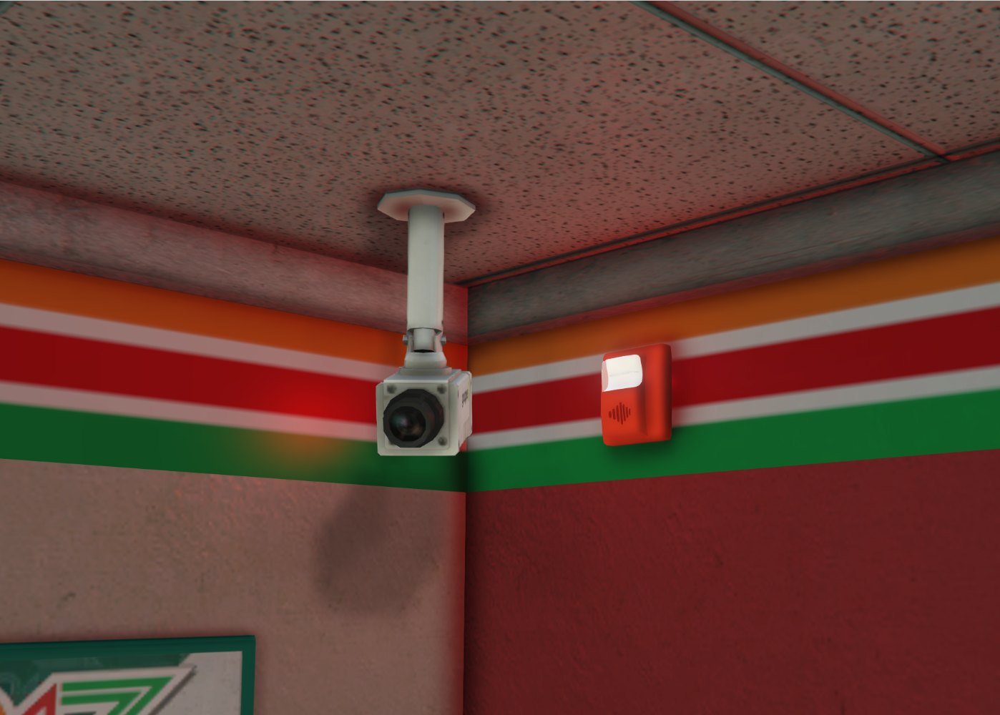
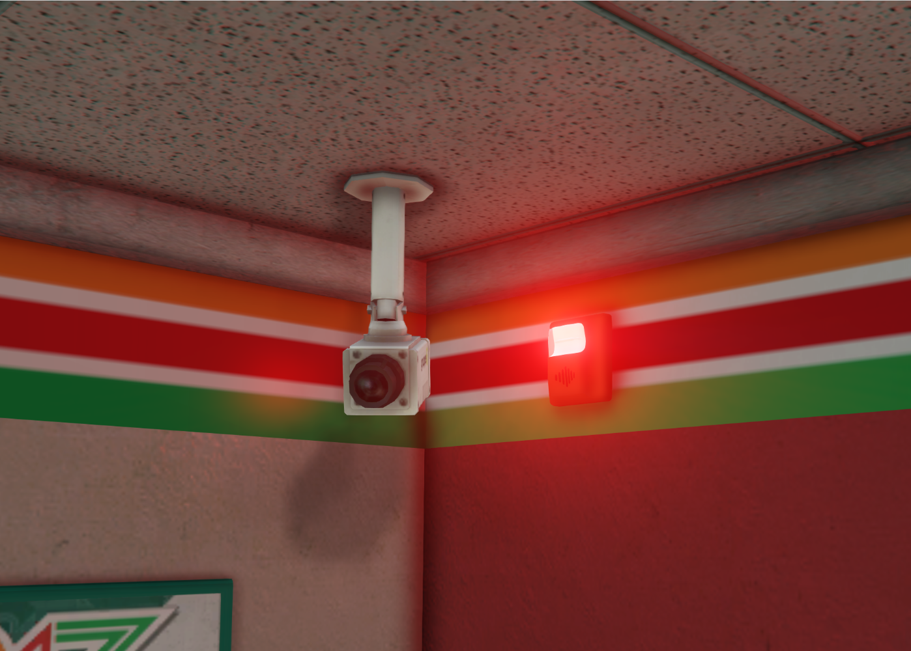

# Changelog

This page documents the changes made to FAR.

## v1.5.\*

### v1.5.2 - 09/22/2025

**Added**:
- [`ic_far_strobeRGBColors`](config.md#strobe-light-rgb-colors) config value to change strobe color, [see here](config.md#strobe-light-rgb-colors) for details.
  - Allows you to change the color of the strobe lights. Be default they are red.

**Fixed**:
- Error logging for default config values not showing their JSON values in the console.

### v1.5.1 - 08/06/2025

**Added**:
- Support for displaying custom date and time in Control Panel
  - Uses the new [`ic_far_timezone`](config.md#timezone) and [`ic_far_timezone_tag`](config.md#timezone-tag) config options. [See here](config.md#timezone) for more info.
  - Replace UTC/GMT time always been used.

**Changed**:
- [Detectors](usage/components.md#detectors--sprinklers) can now be placed on walls, not just the ceiling.
- Wording of the [FAR Tool](developers/tool.md) save message to avoid confusion.

### v1.5.0 - 07/30/2025

**Changed**:
- [`customdata`](developers/tool.md#adding-custom-data) now defaults to `""` (empty string) instead of `nil` when not provided.

**Fixed**:
- [`customdata`](developers/tool.md#adding-custom-data) not being included in editable events.
- Strobes not counting towards the Sounders count when using [`ic_far_strobesHaveSpeakers`](config.md#strobes-have-speakers)
  - This resulted in cases where a location might only have Strobes for sound, but because there were no Sounders, the script would disable audio entirely for the sake of performance.

## v1.4.\*

### v1.4.9 - 07/21/2025
**Added**:
- Requirement for a minimum server version of 12781 or above.
- [`firealarm health`](usage/commands.md#health-check) command.
  - Used to assist with solving problems during tech support.
- "ConVar Permissions" section to config, which prevents other resources from reading private values (like HTTP Access Token).
- Corona to strobes when they flash, resulting in a brighter, better looking effect:

| Before                               | After                              |
|--------------------------------------|------------------------------------|
|  |  |

**Changed**:
- If not provided in an alarm system, `PostalCode` will now return an empty string instead of `nil`.

**Fixed**:
- Existing strobe flash effect appearing below the strobe.
- Some strobe shadows being "brighter" than others.

### v1.4.8 - 07/02/2025
**Added**:
- Custom Data Attribute for Systems.
	- Store whatever information you'd like on a per-system basis, to access from any script. [See here](developers/tool.md#adding-custom-data) for more info.
- [`getAllAlarmSystems`](developers/exports/server.md#get-all-systems) server export, [see here](developers/exports/server.md#get-all-systems) for more info.
- [`triggerRandomAlarm`](developers/exports/server.md#trigger-random-alarm) server export, [see here](developers/exports/server.md#trigger-random-alarm) for more info.
- [`ic_far_strobesHaveSpeakers`](config.md#strobes-have-speakers) which allows alarm sounds to play from strobes.
- Support for Call Creation in [Night Shift's Mobile Data Terminal](https://store.nights-software.com/package/5667103) - enable in `editable/server/events.lua`
- Support for Call Creation in [Codesign Dispatch ](https://codesign.pro/product/4206357) (CD_Dispatch) - enable in `editable/server/events.lua`

**Fixed**:
- Temporary patch that *should* fix the z_Fire x FAR crashes for the time being - make sure z_Fire is up-to-date.

### v1.4.7 - 06/23/2025
**Added**:
- Optional `aop` parameter for Alarm Systems.
  - In an Alarm System's draft file entry, you can add `aop = "..."`, where `...` is an AOP of your choosing. [See here](developers/tool.md#adding-aop) for more info.
  - Once set, you can use the new [`setAlarmAOP`](developers/exports/server.md#set-alarm-system-aop) export to define the AOP. [See here](developers/exports/server.md#set-alarm-system-aop) for more info.
- Infinite radius support for [`getAlarmSystemNearPosition`](developers/exports/server.md#get-system-by-position) by passing `-1` in the `radius` parameter. [See here](developers/exports/server.md#get-system-by-position) for more info.

**Updated**:
- Existing Prop Hiding logic using newer functions developed for [Station Alert](../../resources/station-alert).

### v1.4.6 - 04/29/2025
**Added**:
- Error message when audio is not loaded successfully.
- Coordinates to Sonoran 911 call.
- [`ic_far_twoStageAlarm`](config.md#two-stage-alarm) which allows for the disabling of the voice part of the alarm.

**Changed**:
- Internal structure of two items to prevent rare cases of Mono server crashes.

### v1.4.5 - 04/21/2025
**Added**:
- Hook to activate [Inferno Station Alert](../../resources/station-alert) when Alarm activated.

**Changed**:
- Minor improvement to memory management in the [FAR Tool](developers/tool.md).

**Fixed**:
- Specific types of complex default config values not listing correctly in the console.
- [`resetLastAlarmSystem`](developers/exports/server.md#reset-last-alarm-system) server export calling the same native twice unnecessarily.

### v1.4.4 - 03/22/2025

**Changed**:
- Minor refactor to FAR Tool's demo prop creation logic.

**Fixed**:
- Typo in internal event handling Alarm System updating between client and server.
  - The typo existed both in the event handler and the trigger, so it still functions in prior versions.
- Hidden Metadata not being removed from memory after FAR Tool was closed.
- Preview prop in FAR Tool appearing above the player's head momentarily when first spawned.
- Draft Alarm System data being stored in server memory when it didn't need to be.
- Issue with the Detector Testing where a server error would be thrown.
- Typo in an uncommon error relating to draft alarm systems not being loaded properly.
- An empty error message appearing in the server console when a Draft Alarm system with a syntax error was loaded.
  - Now the error indicates the syntax error is from a "draft alarm system", instead of an empty error message.

### v1.4.3 - 02/24/2025

**Added**:
- [Detector Tester Spray Can](usage/walktest.md#detector-tester-spray-can), [see here](usage/walktest.md#detector-tester-spray-can) for details.
- [`disableInteractions`](developers/exports/client.md#disable-all-interactions) client export, [see here](developers/exports/client.md#disable-all-interactions) for details.
  - The `editable/client/targeting.lua` file has been updated to include `canInteract` entries for both OxTarget and QBTarget, if you use these resources you might want to update this file.
  - If you use your own targeting/third-eye resource, consider making use of the `canInteract()` export, see the examples inside the `editable/client/targeting.lua` file.

**Changed**:
- Some interactions now take priority over others.
  - Interacting with a Control Panel or Pull Station will take priority over Spraying the Detector Spray Can, for example.

### v1.4.2 - 01/20/2025

**Added**:
- Ability to shoot Sprinklers
  - When shot, a Sprinkler will show water.
  - If the Alarm System is not yet in Alarm, it will go into Alarm.

**Changed**:
- HTTP API request logs such that they only log when [Debug Mode](config.md#debug) is enabled.

### v1.4.1 - 01/16/2025

**Fixed**:
- Issue where if two or more Alarm Systems were within 100 units of each other, and one or more Alarm Systems had its props spawned (entering spawn radius), despawned (leaving spawn radius), and then spawned again (reentering spawn radius), the Alarm System's props would not respawn and instead "No Interactable Prop" errors would appear.

### v1.4.0 - 01/13/2025

**Added**:
- New commands:
  - [`/firealarm activations`](usage/commands.md#fire-alarm-activations-log) command, [see here](usage/commands.md#fire-alarm-activations-log) for details.
  - [`/firealarm resetall`](usage/commands.md#reset-all-alarm-systems) command, [see here](usage/commands.md#reset-all-alarm-systems) for details.
  - [`/firealarm resetlast`](usage/commands.md#reset-last-alarm-systems) command, [see here](usage/commands.md#reset-last-alarm-systems) for details.
- New client and server exports:
  - [`sprinklerValveInteraction`](developers/exports/client.md#interact-with-sprinkler-valve-at-player-position) client export, [see here](developers/exports/client.md#interact-with-sprinkler-valve-at-player-position) for details.
  - [`resetAllSystems`](developers/exports/server.md#reset-all-alarm-systems) server export, [see here](developers/exports/server.md#reset-all-alarm-systems) for details.
  - [`resetLastAlarmSystem`](developers/exports/server.md#reset-last-alarm-system) server export, [see here](developers/exports/server.md#reset-last-alarm-system) for details.

**Changed**:
- Optimized syncing of Alarm Systems between Server and Clients.

**Fixed**:
- Some console log messages being malformed.
- Sonoran CAD export in Server Editables missing Alarm System name.

***

## v1.3.\*

### v1.3.9 - 01/06/2025

**Added**:
- Keybinds to the [FAR Tool](developers/tool.md) to allow for minor position and rotation adjustments. [See here](developers/tool.md#arrow-keys) for more information.
- [`enableAlarms`](developers/exports/server.md#enabled-or-disable-all-alarms-globally) export, see [here](developers/exports/server.md#enabled-or-disable-all-alarms-globally) for details.

**Fixed**:
- Error relating to base-game explosions.
- Typo in `config.cfg` for `ic_far_defaultSprinklerValveModel`
  - Existing server owners/developers should search for `sert` and replace with `setr`.

### v1.3.8 - 01/02/2025

:::danger
Major breaking changes to `editable`s and OxTarget were made in this version, do not blindly update.  
Reach out in [Discord](https://inferno.gay/discord) if you need help updating.  
Always make a back-up before updating!
:::

**Added**:
- Support for multiple target/third-eye resources, see below.

**Changed**:
- Multiple [Detector](usage/components.md#detectors--sprinklers)s can now activate for a single fire/smoke event, instead of just the closest.
- Moved all targeting logic into a new client `editable`s folder
  - Allows support for OxTarget & QBTarget out-of-the-box.
  - Owners/developers who previously used `ic_far_oxTargetSupport` will need to enable [`ic_far_manualInteractions`](config.md#manual-interactions-targetthird-eye-resource-support) and edit their `editable/client/targeting.lua` to re-enable support.
    - Reach out in [Discord](https://inferno.gay/discord) if you need help with this.
- Moved server editable files from `editables/` to `editables/server/`.
  - **Existing users will need to manually move their existing `editables` files to the new directory.**
    - Reach out in [Discord](https://inferno.gay/discord) if you need help with this.

**Fixed**:
- OxTarget zones being removed twice, resulting in a harmless error.
- [SmartFires](https://forum.cfx.re/t/smart-fires-automatic-fires-fire-smoke-types-many-integrations-standalone-paid-resource/4792695?u=christopherm)' smoke would not activate detectors.
- Unhandled error and getting stuck in an animation when trying to access a Control Panel another player is using, instead of displaying the friendly pop-up.
- Custom props not being used in the [FAR Tool](developers/tool.md).
	- :::note
	  This fix makes several small changes to the `config.cfg` file, existing users may need to update this themselves.  
      To apply the change, replace `set` with `setr` for the following entries:
      - `ic_far_defaultControlPanelModels` 
      - `ic_far_defaultPullStationModels`
      - `ic_far_defaultDetectorModels`
      - `ic_far_defaultSprinklerModels`
      - `ic_far_defaultSounderModel`
      - `ic_far_defaultStrobeModel`
      - `ic_far_defaultSprinklerValveModel`
      
	  :::danger
  	  **Do not** replace all instances of `set` inside `config.cfg`, only change the entries listed above, otherwise secret values such as the HTTP Access Token can be exposed.
  	  :::

### v1.3.7 - 12/23/2024
**Added**:
- [`ic_far_alarmSystemTimeout`](config.md#alarm-system-timeout) config value, [see here](config.md#alarm-system-timeout) for details.
- [`enableRandomAlarms`](developers/exports/server.md#enabled-or-disable-random-alarms) export, [see here](developers/exports/server.md#enabled-or-disable-random-alarms) for details.

**Fixed**:
- Being unable to open/close Sprinkler Valves properly with OxTarget.
- Detectors not fully resetting when an Alarm System is reset.

### v1.3.6 - 12/16/2024

**Added**:
- [API](developers/api.mdx) with two endpoints:
  - [`alarm-systems`](developers/api.mdx#get-alarm-system-by-status) endpoint, [see here](developers/api.mdx#get-alarm-system-by-status) for details.
  - [`alarm-system`](developers/api.mdx#get-alarm-system-by-id) endpoint, [see here](developers/api.mdx#get-alarm-system-by-id) for details.
- Two new client exports:
	- [`pullStationInteraction`](developers/exports/client.md#interact-with-pull-station-at-player-position) export, [see here](developers/exports/client.md#interact-with-pull-station-at-player-position) for details.
    - [`controlPanelInteraction`](developers/exports/client.md#interact-with-control-panel-at-player-position) export, [see here](developers/exports/client.md#interact-with-control-panel-at-player-position) for details.

**Changed**:
- Increased maximum prop spawning distance from 75 meters to 100 meters, and maximum [FAR Tool](developers/tool.md) prop placement from 35 meters to 75 meters.
  - The aim of this change is to allow for physically larger Alarm Systems to be created.
- Editable [events](developers/events.md) such that they cannot be triggered from the client.

**Removed**:
- Logic that checked if an interior had loaded before spawning FAR Props.
  - Caused issues with add-on MLOs located in the same position as base-game MLOs.

**Fixed**:
- Announcements not working correctly from the Control Panel.
- Passcode error pop-up when creating a new Alarm Location with the [FAR Tool](developers/tool.md).
- Erroneous file name being shown when saving an existing draft with the [FAR Tool](developers/tool.md).
- Being able to load empty `.lua` files as valid drafts for [FAR Tool](developers/tool.md).

### v1.3.5 - 12/09/2024

**Added**:
- Alarm System Monitoring
  - Adds a `monitoring` parameter to the [`AlarmSystem`](developers/data.mdx#alarm-system) object.
  - Designed to represent if an Alarm System is being monitored by an Alarm Monitoring Company, such as Gruppe Sechs.
  - Can be used when handling activation events to determine if the alarm activation should result in an automatic page/call/etc. to Emergency Services, for example:
    - ```lua
      RegisterServerEvent("Inferno-Collection:Server:FireAlarmReborn:Editable:AlarmActivation")
          AddEventHandler("Inferno-Collection:Server:FireAlarmReborn:Editable:AlarmActivation", function(alarmSystem)
			
          -- Monitoring is not enabled, so we will not page the Fire Dept.
          if not alarmSystem.monitoring then
              return
          end
			
          Pager:NewPage("Fire Alarm - " .. alarmSystem.name .. " - " .. alarmSystem.location)
      end)
      ```
  - Value is `true` by default, and can be changed in one of two ways:
    1. In-game, by using the Control Panel and locating the Disable Monitoring option in the Main Menu.
    2. Out-of-game, by adding `monitoringDisabled = "true"` to Alarm System entries.
  - [`MonitoringDisabled`](developers/events.md#monitoring) event.

**Changed**:
- Logic that checked if interiors were full loaded before spawning FAR props.
  - Previously, if an interior was reporting as "not ready", FAR would not spawn props at all.
  - Now, FAR will load props after 15 seconds regardless.
    - This resolves an issue with FAR props not loading at locations where addon MLOs intersected with base-game MLOs.
- Multiple players can now use the [FAR Tool](developers/tool.md) at the same time.

**Fixed**:
- "Press E to ..." prompts appearing even when [`ic_far_oxTargetSupport`](config.md#manual-interactions-targetthird-eye-resource-support) was set to `true`.
- OxTarget Sprinkler Valve interactions duplicating.
- [Random Alarms](config.md#random-alarms) being triggered even when there were no players in server.
- Bug that prevented the loading of draft Alarm Systems that shared locations with a live Alarm Systems already loaded. 

**Removed**:
- Per-Control Panel passcodes.
  - Passcodes are now per-Alarm System.
  - Existing Alarm Systems can be updated by moving `passcode = "..."` from the Control Panel entry into the Alarm System entry.
    - Reach out in [Discord](https://inferno.gay/discord) if you need help converting old systems.

### v1.3.4 - 12/04/2024

**Fixed**:
- Hidden Props reappearing momentarily ('flickering') when an Alarm System changed status, such as from standby into alarm.

### v1.3.3 - 12/01/2024

:::danger
Breaking changes to the [Exports](developers/exports/server.md) were made in this version, do not blindly update.
:::

**Added**:
- [`ic_far_sprinklerChance`](config.md#sprinkler-chance-to-extinguish-fire) config value, [see here](config.md#sprinkler-chance-to-extinguish-fire) for details.
- [`ic_far_allowBadResets`](config.md#allow-badinvalid-alarm-system-resets) config value, [see here](config.md#allow-badinvalid-alarm-system-resets) for details.
- [`ic_far_realisticAudio`](config.md#use-realistic-audio-for-sounders) config value, [see here](config.md#use-realistic-audio-for-sounders) for details.
- [`triggerPullStationNearPosition`](developers/exports/server.md#trigger-pull-station-near-position) export, [see here](developers/exports/server.md#trigger-pull-station-near-position) for details.

**Changed**:
- Multiple Sprinklers can now activate for the same fire.
  - Previously, only the closest Sprinkler within X distance of a fire would activate, now all Sprinklers with X distance will activate.
  - The distance ('X') from the fire to the Sprinkler has been reduced slightly to avoid "too many" Sprinklers activating.
- Pre-activated Sprinklers now extinguish new fires.
  - :::note
  	This only applies to [z_Fires](https://forum.cfx.re/t/paid-standalone-esx-qbcore-z-fire/5244464?u=christopherm) and [SmartFires](https://forum.cfx.re/t/smart-fires-automatic-fires-fire-smoke-types-many-integrations-standalone-paid-resource/4792695?u=christopherm).
  	:::
  - Previously, once a Sprinkler was activated, any new fires in the same location while the Sprinkler was still active would not be extinguished; this is no longer the case.
- [`triggerPullStationAtPosition`](developers/exports/server.md#trigger-pull-station-at-position) export now activates the closet Pull Station to the provided position, not a random Pull Station.
  - For random Pull Stations, use [`triggerPullStationNearPosition`](developers/exports/server.md#trigger-pull-station-near-position).

**Fixed**:
- Issue where randomly generated z_Fires smoke was causing server errors and Sprinklers not to activate.

### v1.3.2 - 11/27/2024
**Fixed**:
- All fires created by z_Fires were put out after a few seconds, regardless of Sprinklers.
- [AlarmActivation](developers/events.md#alarm-activation) event being fired multiple times.
- Typo in `ic_far_defaultSprinklerValveDistanceCheck` config option.
- ALARM and BUZZER Control Panel LEDs still blinking after being muted.

### v1.3.1 - 11/25/2024
**Fixed**:
- Resets being soft locked if first reset attempt failed.
- FIRE LED state not updating until FIRES button was pressed.
- Sprinklers reactivating for a few seconds if the Sprinkler Valve is Closed, and a new component is activated.
- Edge case where the distance check for the nearest interactable component would fail.
- [`ic_far_disablePasscodes`](config.md#disable-passcodes) config option being ignored.
- TEST button saying a passcode is required, when [`ic_far_disablePasscodes`](config.md#disable-passcodes) is `true`.
- ALARM and BUZZER LEDs being stuck in the ON condition after being tested.
- SILENCE ALARM button not working if an Alarm System was silence, but a second component was then activated.

***

### v1.3 - 11/19/2024
**Added**:
- Sprinkler Valves
  - Sprinkler Valves are optional, any systems without a Sprinkler Valve will behave as it did prior to v1.3.
  - Only one Sprinkler Valve can be placed per Alarm System.
  - Sprinkler Valves have two positions:
    - Open
      - Water can flow.
      - Sprinklers will activate.
      - Sprinkler Bell will sound.
    - Closed
      - Water cannot flow.
      - Sprinklers will not activate, and pre-activated Sprinklers will stop showing water.
        - If the Sprinkler Valve is Opened again after being Closed, but before a system reset, pre-activated Sprinklers will show water again.
      - Sprinkler Bell will not sound.
  - If an Alarm System is in Alarm, and there is a triggered Sprinkler, the Sprinkler Valve must be placed in the Closed position before the system can reset.
    - :::tip
    	Be sure to place it back in the Open position afterward though, or else Sprinklers will not activate when there's a fire!
  		:::
  - Sprinkler Valves have their own [Ace Permission](config.md#use-sprinkler-valves).
  - [`SprinklerValveChanged` event](developers/events.md#sprinkler-valve-change).

**Changed**:
- If an Alarm System contains a Sprinkler Valve, the Sprinkler Bell sound effect will come from the position of the Sprinkler Valve instead of the center of the Alarm System.
  - :::tip
  	Not sure where the Sprinkler Valve is located in an Alarm System? Follow the sound of the bell!
  	:::

**Removed**:
- Server console warning about permissions not being correctly set-up.
  - Replaced by the [`config.cfg` error message](#v11---11112024) added in v1.1.

***

## v1.2.\*

### v1.2.2 - 11/18/2024

:::danger
Major breaking changes to the [Events](developers/events.md) were made in this version, do not blindly update.
:::
**Added**:
- [`AlarmActivation`](developers/events.md#alarm-activation) event, which is the new recommended way to listen for Alarm System activation.
- [`getAlarmSystemComponents`](developers/exports/server.md#get-system-components) export, which returns an [`AlarmSystemComponents`](developers/data.mdx#alarm-system-components) table, containing all an Alarm System's Pull Station, Detectors, etc.
  - [`AlarmSystemComponents`](developers/data.mdx#alarm-system-components) is a new [Data type](developers/data.mdx).

**Changed**:
- All the events listed below now have an [`AlarmSystem`](developers/data.mdx#alarm-system) parameter passed along with the event. See [Events](developers/events.md) for full details.
  - [`PullStationTriggered`](developers/events.md#pulled)
  - [`PullStationReset`](developers/events.md#reset)
  - [`OpenControlPanel`](developers/events.md#opened)
  - [`DetectorActivation`](developers/events.md#triggered)
  - [`SprinklerActivation`](developers/events.md#triggered-1)

**Removed**:
- `getAlarmSystem` export.
  - If you know the ID of the Alarm System, you likely already have access to an [`AlarmSystem`](developers/data.mdx#alarm-system) object.
  - If you want to get all of an Alarm System's Control Panels, Pull Stations, etc., use the new [`getAlarmSystemComponents`](developers/exports/server.md#get-system-components) export.
- Components from the [`AlarmSystem`](developers/data.mdx#alarm-system) data type.
  - Components are now stored in [`AlarmSystemComponents`](developers/data.mdx#alarm-system-components) and can be accessed via the [`getAlarmSystemComponents`](developers/exports/server.md#get-system-components) export.
- `alarmSystemId` from all components (Pull Stations, Sounders, etc.).
  - If you know the ID of the Alarm System, you likely already have access to an [`AlarmSystem`](developers/data.mdx#alarm-system) object.

***

### v1.2.1 - 11/17/2024
**Added**:
- Example in `editable/pager.lua` for changing tones paged based on which Alarm System is activated.

**Fixed**:
- Issue where not passing enough arguments to [Exports](developers/exports/server.md) would throw a confusing error.
- [`PullStationTriggered`](developers/events.md#pulled) event example code referencing a non-existed variable.
- `alarmSystemId` parameter on data returned by [Exports](developers/exports/server.md) incorrectly being passed as `alarmSystem`.
***

### v1.2 - 11/16/2024
**Added**:
- Check to prevent multiple of the same Alarm System being loaded.
- Error message when a file listed as an `fire_alarms` file could not be found.

**Changed**:
- Warning and Error messages when ingesting Alarms System files to match the style of others from the resource, as well as to include both the file and resource name when referring to Alarm Systems.
  - Example: `INFO: Ingested 15 Alarm Systems from **food_stores.lua** (**inferno-alarms**), 48 total.`

**Fixed**:
- Errors appearing in the client console complaining about config values not being set, when really they had.
- The error message that appeared when you had no set default model values, showing the default values as `Dictionary<bool,sting> etc` instead of their actual JSON values.
- Multiple people being able to interact with an Alarm System Control Panel at once.
  - Even if there are multiple Control Panels for one Alarm System, only one can be used at once.
- [`SystemDisabled` event](developers/events.md#disabled) not being fired.

***

## v1.1.\*

### v1.1 - 11/11/2024
**Added**:
- `IgnoreProximity` flag for Alarm Systems which removes the warning in the server console when one or more systems are within 30 units of each other.
:::warning
We suggest only using this if you're confident you've set up your alarm systems far enough away from each other not to overlap.
:::
- Error message to the server console that appears when the `config.cfg` file has not been executed.
- `triggerPullStationAtPosition` Export which allows for the activation of a random Pull Station of a system within 50 units of the provided position.
- `getAlarmSystemPasscode` Export which returns just an Alarm System's passcode.

**Fixed**:
- Space Bar missing from the Tool controls helper.
- Typos 😔
- Outdated docs link.
- Bug that prevent all but the first Alarm System's Control Panel from opening.
- Postal codes not being loaded from Alarm System files.
- Missing sounders in some of the stock resources.

***

### v1 - 11/11/2024
Initial resource release.
