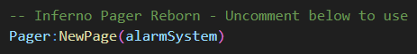
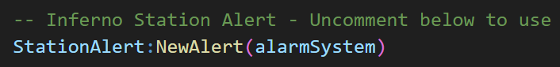

# First-Party Resources
This page explains how to integrate FAR with first-party resources (other Inferno Collection resources).

## Pager Reborn
Follow the steps below to create a page when a fire alarm is activated.

1. Inside `inferno-fire-alarm-reborn`, open `editable/server/events.lua`.
2. Locate the `Inferno Pager Reborn - Uncomment below to use`, then uncomment (remove the `--`) the section below.

By default, the `events.lua` calls `Pager:NewPage`, which will create a page message for `emg.fire.*`.  
You can edit this by making changes in `editable/server/pager.lua`.

Alternatively, there is another function called `Pager:NewPageByAlarmSystem` which you can use instead, which allows for a different page depending on which fire alarm is activated. To use this, replace `Pager:NewPage` with `Pager:NewPageByAlarmSystem` in `events.lua`.

## Station Alert
Follow the steps below to create alerts when a fire alarm is activated.

1. Inside `inferno-fire-alarm-reborn`, open `editable/server/events.lua`.
2. Locate the `Inferno Station Alert - Uncomment below to use`, then uncomment (remove the `--`) the section below.

By default, the `events.lua` calls `StationAlert:NewAlert`, which will create an alert at the nearest "manned" fire station (station with players).
You can customize the `exports` to your liking by editing `editables/server/station-alert.lua`. For more information on `exports`, see [here](../../station-alert/developers/exports/server.md).

Alternatively, there is another function called `StationAlert:NewAlertByAlarmSystem` which you can use instead, which allows for a different alert depending on which fire alarm is activated. To use this, replace `StationAlert:NewAlert` with `StationAlert:NewAlertByAlarmSystem` in `events.lua`.
