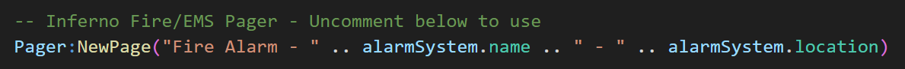
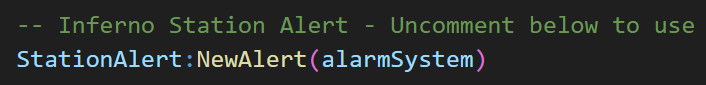
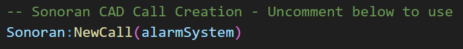
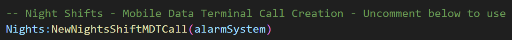
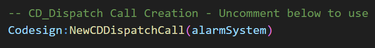

# Third-Party Resources
This page explains how to integrate FAR with third-party resources.

## Fire Scripts
FAR has automatic integration with all the fire resource listed below, no changes are required to be made by the end-user.

- Albo1125's Fire Script
- GIMIcz's Fire Script
- GRC's MRC Fire
- Toxic Scripts' Realistic Fire Script
- Zea Development's z_fires
- London Studios' Smart Fires
- rScript's Fire Generator

For more information, [see here](../index.md#fire-script-compatibility-list).

## Inferno Fire/EMS Pager (2019)
Follow the steps below to create a page when a fire alarm is activated.

1. Inside `inferno-fire-alarm-reborn`, open `editable/server/events.lua`.
2. Locate the `Inferno Fire/EMS Pager - Uncomment below to use`, then uncomment (remove the `--`) the section below.

By default, the `events.lua` calls `Pager:NewPage`, which will create a page message for `fire`.  
You can edit this by making changes in `editable/server/pager.lua`.

Alternatively, there is another function called `Pager:NewPageByAlarmSystem` which you can use instead, which allows for a different page depending on which fire alarm is activated. To use this, replace `Pager:NewPage` with `Pager:NewPageByAlarmSystem` in `events.lua`.

## Station Alert
Follow the steps below to create alerts when a fire alarm is activated.

1. Inside `inferno-fire-alarm-reborn`, open `editable/server/events.lua`.
2. Locate the `Inferno Station Alert - Uncomment below to use`, then uncomment (remove the `--`) the section below.

By default, the `events.lua` calls `StationAlert:NewAlert`, which will create an alert at the nearest "manned" fire station (station with players).
You can customize the `exports` to liking by editing `editables/server/station-alert.lua`. For more information on `exports`, see [here](../../station-alert/developers/exports/server.md).

Alternatively, there is another function called `StationAlert:NewAlertByAlarmSystem` which you can use instead, which allows for a different alert depending on which fire alarm is activated. To use this, replace `StationAlert:NewAlert` with `StationAlert:NewAlertByAlarmSystem` in `events.lua`.

## Sonoran CAD
Follow the steps below to create calls in Sonoran CAD when a fire alarm is activated.

1. Inside `inferno-fire-alarm-reborn`, open `editable/server/events.lua`.
2. Locate the `Sonoran CAD Call Creation - Uncomment below to use`, then uncomment (remove the `--`) the section below.

You can customize the call details to liking by editing `editables/server/sonoran.lua`. For more information, see [here](https://docs.sonoransoftware.com/cad/api-integration/api-examples/emergency/lua-examples/dispatch-and-emergency-calls/new-911-call#parameters).

## Night Shifts MDT
Follow the steps below to create calls in Night Shifts MDT when a fire alarm is activated.

1. Inside `inferno-fire-alarm-reborn`, open `editable/server/events.lua`.
2. Locate the `Night Shifts - Mobile Data Terminal Call Creation - Uncomment below to use`, then uncomment (remove the `--`) the section below.

You can customize the call details to liking by editing `editables/server/nights.lua`. For more information, see [here](https://docs.nights-software.com/resources/nightShifts/).

## Codesign Dispatch
Follow the steps below to create calls in Codesign Dispatch when a fire alarm is activated.

1. Inside `inferno-fire-alarm-reborn`, open `editable/server/events.lua`.
2. Locate the `CD_Dispatch Call Creation - Uncomment below to use`, then uncomment (remove the `--`) the section below.

You can customize the call details to liking by editing `editables/server/codesign.lua`. For more information, see [here](https://docs.codesign.pro/paid-scripts/dispatch/resource-integration#paid-resources).
