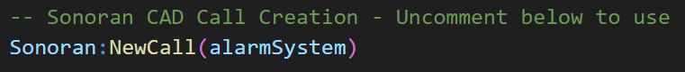
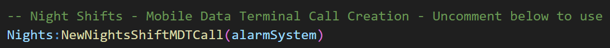
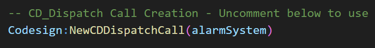
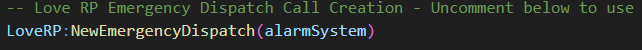

# Third-Party Resources
This page explains how to integrate FAR with third-party resources.

## Fire Scripts
FAR has automatic integration with all the fire resource listed below, no changes are required to be made by the end-user.

- Albo1125's Fire Script
- GIMIcz's Fire Script
- GRC's MRC Fire
- Toxic Scripts' Realistic Fire Script
- Zea Development's z_fires
- London Studios' Smart Fires
- rScript's Fire Generator

For more information, [see here](../index.md#fire-script-compatibility-list).

## Sonoran CAD
Follow the steps below to create calls in Sonoran CAD when a fire alarm is activated.

1. Inside `inferno-fire-alarm-reborn`, open `editable/server/events.lua`.
2. Locate the `Sonoran CAD Call Creation - Uncomment below to use`, then uncomment (remove the `--`) the section below.

You can customize the call details to your liking by editing `editables/server/sonoran.lua`. For more information, see [here](https://docs.sonoransoftware.com/cad/api-integration/api-examples/emergency/lua-examples/dispatch-and-emergency-calls/new-911-call#parameters).

## Night Shifts MDT
Follow the steps below to create calls in Night Shifts MDT when a fire alarm is activated.

1. Inside `inferno-fire-alarm-reborn`, open `editable/server/events.lua`.
2. Locate the `Night Shifts - Mobile Data Terminal Call Creation - Uncomment below to use`, then uncomment (remove the `--`) the section below.

You can customize the call details to your liking by editing `editables/server/nights.lua`. For more information, see [here](https://docs.nights-software.com/resources/nightShifts/).

## Codesign Dispatch
Follow the steps below to create calls in Codesign Dispatch when a fire alarm is activated.

1. Inside `inferno-fire-alarm-reborn`, open `editable/server/events.lua`.
2. Locate the `CD_Dispatch Call Creation - Uncomment below to use`, then uncomment (remove the `--`) the section below.

You can customize the call details to your liking by editing `editables/server/codesign.lua`. For more information, see [here](https://docs.codesign.pro/paid-scripts/dispatch/resource-integration#paid-resources).

## LoveRP Emergency Dispatch
Follow the steps below to create calls in LoveRP's Emergency Dispatch when a fire alarm is activated.

1. Inside `inferno-fire-alarm-reborn`, open `editable/server/events.lua`.
2. Locate the `Love RP Emergency Dispatch Call Creation - Uncomment below to use`, then uncomment (remove the `--`) the section below.  
   

You can customize the call details to your liking by editing `editables/server/loverp.lua`. For more information, see [here](https://docs.codesign.pro/paid-scripts/dispatch/resource-integration#paid-resources).
