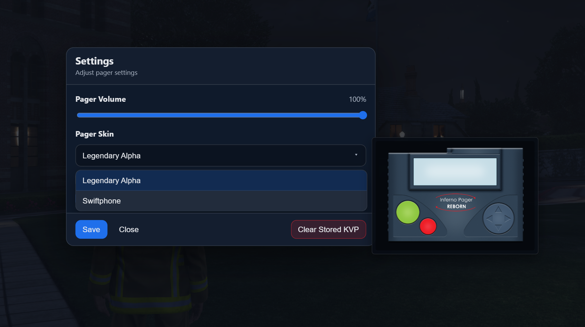

# Changelog

This page documents the changes made to Pager Reborn.

## v1.1.*

### v1.1.5 - 05/18/2026

**Fixed**:
- Players not populating the Player list in Page Creation UI when [`ic_pr_inventorySupport`](config.md#inventory-support) was `true`.
- Issue with nodes becoming malformed when syncing back to Sonoran CAD when [`ic_pr_dataSource`](config.md#data-source) was set to `1` (Sonoran).

### v1.1.4 - 05/16/2026

**Fixed**:
- Issue with data being loaded from Sonoran CAD when [`ic_pr_dataSource`](config.md#data-source) was set to `1` (Sonoran).

### v1.1.3 - 05/14/2026

**Added**:
- Sonoran CAD Support.
  - Works with all versions of Sonoran CAD, including the free version.
  - Send Page messages to addresses or individual units from Sonoran CAD.
  - If [`ic_pr_dataSource`](config.md#data-source) is configured for Sonoran, Embedded Pager Network Designer can store data in Sonoran CAD.
- [Pager Reborn: Sonoran Edition](https://sonoran.link/Y3HffqTd). For more info, [see here](https://sonoran.link/Y3HffqTd).
  - 

### v1.1.2 - 05/08/2026

**Added**:
- New [`/pager settings`](usage/commands.md#open-pager-settings-ui) options:
  - Option to only hear own Pager sounds.
    - When enabled, players will only hear their own Pager sounds.
  - Option to disable unread message chirps.
      - When disabled, no chirps will play when a player has any unread messages.
  - Option to change the skin of the Pager UI.
      - A dropdown shows the list of skins, and hovering over an option will show a preview.
      - 
- [`ic_pr_skins`](config.md#skins) config option. For more info, [see here](config.md#skins).
  - Defines skins that can be used for the Pager UI, selectable from the [Pager Settings UI](usage/quick-start.md#pager-settings).
- [`ic_pr_maxAudioDistance`](config.md#max-audio-distance) config option. For more info, [see here](config.md#max-audio-distance).
  - Defines the maximum distance at which Pager sounds can be heard.

**Fixed**:
- Edge case where resource would crash if an empty permissions file was provided.
- Addresses defined in [`ic_pr_globalDefaultAddresses`](config.md#global-default-addresses) not being applied if address differed from permission name.

### v1.1.1 - 04/13/2026

**Added**:
- "Mark All Read" option to Pager UI.
  - When selected, will mark all unread messages as read.
- "Delete All Messages" option to Pager UI.
  - When selected, will delete all saved messages.
- Confirmation step for the "Power Off" option in Pager UI.

**Changed**:
- The animation for holding the Pager will now restart if interrupted.

**Fixed**:
- Duplicate KVP write on Page acknowledgement.
- Issue where using the [`/pager clearkvp`](usage/commands.md#clear-saved-data) command would only null out data, not delete it.

### v1.1.0 - 04/01/2026
Full release.

**Added**:
- Chat suggestions for commands as an editable client file.

**Changed**:
- Added a short delay inside editable page creations.
  - Reduces strain on the server by not making so many calls at once.

## v1.0.*

### v1.0.7 - 03/27/2026

**Added**:
- Integration for Station Alert. For more info, [see here](developers/first-party.md#station-alert).
- Integration for CodeSign Dispatch. For more info, [see here](developers/third-party.md#cd_dispatch).
- Integration for LoveRP Emergency Dispatch. For more info, [see here](developers/third-party.md#loverp-emergency-dispatch).

**Fixed**:
- Issue where page creation from inside the `events.lua` file could fail.

### v1.0.6 - 03/26/2026

**Added**:
- [`subscribeToNodes`](developers/exports/server.md#subscribe-to-nodes) server export. For more info, [see here](developers/exports/server.md#subscribe-to-nodes).
	- Allows subscribing to node activity from external resources.
	- For example, when a specific node is paged, run custom Lua to send a message to Discord.
- [`newPagePlayersAround`](developers/exports/server.md#create-new-page-around-position) server export. For more info, [see here](developers/exports/server.md#create-new-page-around-position).
  - Allows targeting players around a position to create a new page (e.g., a fire station).

### v1.0.5 - 03/25/2026

**Added**:
- Ability to tie Pager Roles directly to Ace Principals. For more info, [see here](developers/start-here.md#ace-permissions).
- **Pager Network Designer Additions**:
  - Permissions Editor
    - Ability to add player names with identifiers, so you can better tell apart players.
    - Optional "Ace Permission" input for roles to add the Pager Role to players with the matching Ace Permission in server.
    - "Duplicate" and "Delete" buttons for Roles and Players.

**Changed**:
- [`/pager health`](usage/commands.md#health-check) output to include capcode assignments for players with pagers.
  - Allows you to see what capcodes users are assigned to.
- **Pager Network Designer Changes**:
	- Permissions Editor
		- Roles/Players are now listed alphabetically.

**Fixed**:
- Implementation error in [`PageAnyAddress`](config.md#page-any-address) that incorrectly built an array from addresses instead of permissions.

### v1.0.4 - 03/23/2026

**Added**:
- [`getPagerTurnedOff`](developers/exports/server.md#get-pager-turned-off) server export. For more info, [see here](developers/exports/server.md#get-pager-turned-off).
  - Check from the server is a player's pager is turned off.
- Inventory support for [OxInventory](https://overextended.dev/ox_inventory) and [QBInventory](https://docs.qbcore.org/qbcore-documentation/qbcore-resources/qb-inventory). For more info, [see here](config.md#inventory-support).

**Fixed**:
- Maximum body length check incorrectly reading from [`ic_pr_maxAddressesPerPage`](config.md#max-addresses-per-page) instead of [`ic_pr_maxPageBodyLength`](config.md#max-page-body-length).

### v1.0.3 - 03/21/2026

**Added**:
- Scroll wheel zoom in/out support for the Pager UI.
  - Like with position, zoom level is saved between sessions.
- [`PageAnyAddress`](config.md#page-any-address) Ace Permission. For more info, [see here](config.md#page-any-address).
  - Players with this permission can page any address.

**Changed**:
- Pager UI can now be dragged using the Pager buttons.
  - Previously, all drag events were ignored if started from a button.

**Fixed**:
- `editable` files being escrowed by accident.
- [`/pager capcodes`](usage/commands.md#pager-capcodes) and [`/pager new`](usage/commands.md#pager-new) having no nodes to select from.
- Some client-side-only commands being accessible from the server console.
- Oversight where invalid player server IDs could be passed to server exports.

### v1.0.2 - 03/20/2026

**Added**:
- [`CreatePage`](developers/events.md#create-page---server) server event. For more info, [see here](developers/events.md#create-page---server).
	- Event is a work-in-progress while in Early Access and may change.
	- Allows for creating page messages via events.
- [`togglePager`](developers/exports/client.md#toggle-pager) client export. For more info, [see here](developers/exports/client.md#toggle-pager).
  - Allows for toggling the Pager UI via an export.
- `/pager permissiondebug` command. For more info, [see here](usage/commands.md#permission-debug).
  - Prints a player's paging permissions to the server console.

**Changed**:
- Improved the logic that checks for unread messages and players' chirp sounds.

**Fixed**:
- Edge case where [`setPagerTurnedOff`](developers/exports/client.md#set-pager-turned-off) could be called while the Pager UI was open.

### v1.0.1 - 03/19/2026

**Added**:
- [`UsePager`](config.md#use-pager) Ace permission. For more info, [see here](config.md#use-pager).
  - Players without this permission will not be able to use the Page UI.

**Fixed**:
- [Global Defaults](config.md#global-default-addresses) not being applied when a player had no other role/player permissions.

### v1 - 03/17/2024
Easy Access release.
