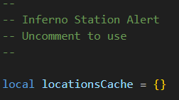
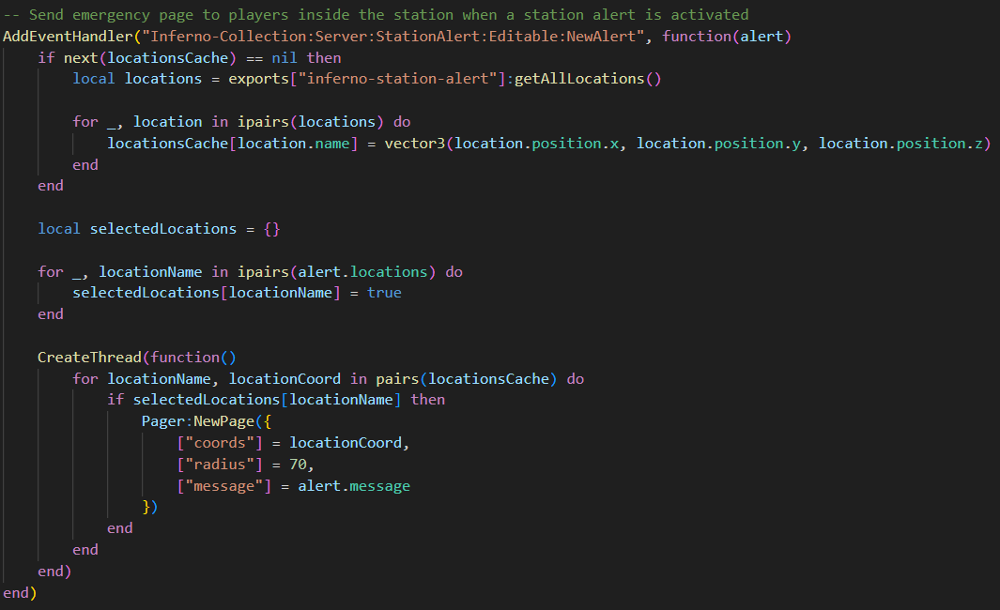
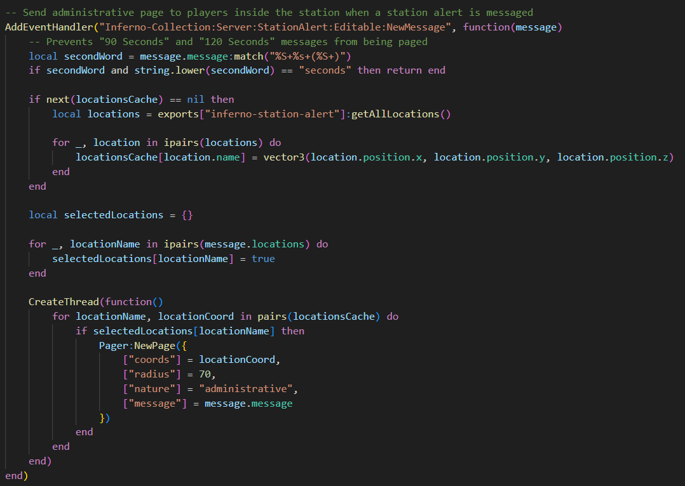

# First-Party Resources
This page explains how to integrate SA with first-party resources (other Inferno Collection resources).

## Station Alert
There are two options for integrating Station Alert:
- Station Alert triggers Pager Reborn
- Pager Reborn triggers Station Alert

The two systems are complementary and can be used together to serve different purposes.

### Station Alert → Pager Reborn
This setup is designed such that Station Alert stations/locations can "trigger" (page) Pager Reborn Nodes. For example, an external resource triggers a station alert; SA can then activate the pagers of all players within the radius of the fire station.

Follow the steps below to enable this functionality:

1. Inside `inferno-pager-reborn`, open `editable/server/events.lua`.
2. Locate the `Inferno Station Alert`, then uncomment (remove the `--`) the section below.  
   
3. To send an emergency page to players inside the station when a station alert is activated, uncomment (remove the `--`) the section below.  
   
4. To send an administrative page to players inside the station when a station alert is messaged, uncomment (remove the `--`) the section below.
   

You can customize `Pager:NewPage` to your liking using the same parameters as the [`CreatePage` event](events.md#create-page---server).

### Pager Reborn → Station Alert
This setup is designed such that Station Alert stations/locations can "listen in" (subscribe) to existing Nodes on Pager Reborn. For example, you might design your Pager Network such that each Fire Station has its own Node. Then to activate a station alert, you would only need to page that station's Node. Another example would be subscribing all fire stations to all fire-related nodes, so that all stations activate for all calls.

To enable this kind of integration, [see here](../../station-alert/developers/first-party.md#pager-reborn--station-alert).

## Fire Alarm Reborn
To create a page when a fire alarm is triggered, [see here](../../fire-alarm-reborn/developers/first-party.md#pager-reborn).
