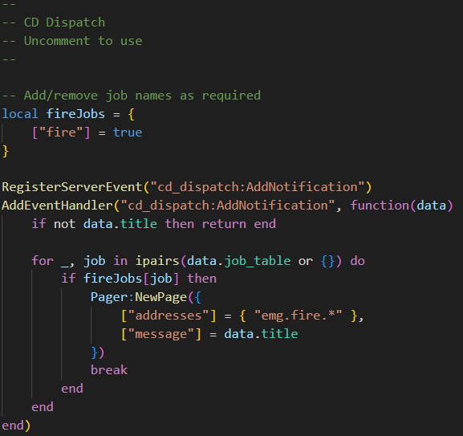
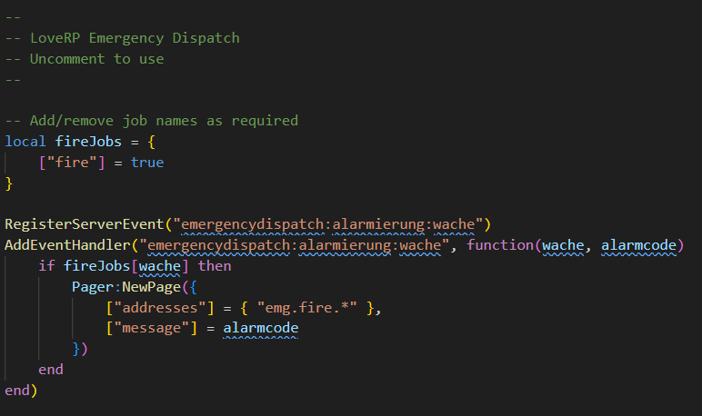

# Third-Party Resources
This page explains how to integrate PR with third-party resources.

## zFires
Follow the steps below to send a page when a player started fire is created, and when automatic incidents are created.

:::warning
This is a temporary integration; the resource will be updated soon so you do not need to copy/paste by hand.
:::

Old - Lines 232-240:
```lua title="core/server/classes/Bridge.lua"
if integrations["infernoPager"] then
    hasSentAlert = true
    TriggerEvent(
        "Fire-EMS-Pager:PageTones",
        { "fire" },
        true,
        { incident.type, incident.description, incident.location }
    )
end
```

New - Lines 232-238:
```lua title="core/server/classes/Bridge.lua"
if integrations["infernoPager"] then
    hasSentAlert = true
    TriggerEvent("Inferno-Collection:Server:PagerReborn:Editable:CreatePage", {
        addresses = {"emg.fire.*"},
        message = incident.description .. " " .. incident.location
    })
end
```

## SmartFires
Follow the steps below to send a page when a player started fire is created, and when automatic fires are created.

:::warning
This is a temporary integration; the resource will be updated soon so you do not need to copy/paste by hand.
:::

Old - Lines 459-465:
```lua title="sv_utils.lua"
if main.fireAlerts.infernoPager.enabled then
    local message = {firstToUpper(fires[id].type), translations.fireDescription}
    if fires[id].automatic.created then
        message = {fires[id].automatic.type, translations.fireDescription}
    end
    TriggerClientEvent("Fire-EMS-Pager:PlayTones", -1, main.fireAlerts.infernoPager.pagersToTrigger, true, message)
end
```

New - Lines 458-472:
```lua title="sv_utils.lua"
if main.fireAlerts.infernoPager.enabled then
    local description = translations.fireDescription

    if fires[id].automatic.created then
        description = fires[id].automatic.type .. " " .. description
    else
        description = firstToUpper(fires[id].type) .. " " .. description
    end

    TriggerEvent("Inferno-Collection:Server:PagerReborn:Editable:CreatePage", {
        addresses = main.fireAlerts.infernoPager.pagersToTrigger,
        description = description,
        location = fires[id].streetName
    })
end
```

## CD_Dispatch
Follow the steps below to send a page when a new notification is created for one or more specific jobs.

1. Inside `inferno-pager-reborn`, open `editable/server/events.lua`.
2. Locate the `CD Dispatch`, then uncomment (remove the `--`) the section below.
	
3. Update `fireJobs` with the names of jobs you would like to use.

You can customize the `Pager:NewPage` to your liking using the same parameters as the [`newPage`](exports/server.md#create-new-page) export.

## Emergency Dispatch
Follow the steps below to create alerts when a new notification is created for one or more specific jobs.

1. Inside `inferno-pager-report`, open `editable/server/events.lua`.
2. Locate the `LoveRP Emergency Dispatch`, then uncomment (remove the `--`) the section below.
   
3. Update `fireJobs` with the names of jobs you would like to use.

You can customize the `Pager:NewPage` to your liking using the same parameters as the [`newPage`](exports/server.md#create-new-page) export.
