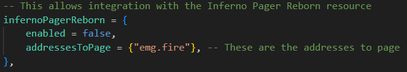

# Third-Party Resources
This page explains how to integrate PR with third-party resources.

## zFires
Follow the steps below to send a page when a player started fire is created, and when automatic incidents are created.

:::warning
This is a temporary integration; the resource will be updated soon so you do not need to copy/paste by hand.
:::

Old - Lines 232-240:
```lua title="core/server/classes/Bridge.lua"
if integrations["infernoPager"] then
    hasSentAlert = true
    TriggerEvent(
        "Fire-EMS-Pager:PageTones",
        { "fire" },
        true,
        { incident.type, incident.description, incident.location }
    )
end
```

New - Lines 232-238:
```lua title="core/server/classes/Bridge.lua"
if integrations["infernoPager"] then
    hasSentAlert = true
    TriggerEvent("Inferno-Collection:Server:PagerReborn:Editable:CreatePage", {
        addresses = {"emg.fire.*"},
        message = incident.description .. " " .. incident.location
    })
end
```

## SmartFires
Follow the steps below to send a page when a player started fire is created, and when automatic fires are created.

1. Inside `SmartFires`, open `config.lua`.
2. Locate `fireAlerts = {...}`, then find `['infernoPagerReborn'] = {...}`.
	
3. Set `enabled` to `true`, and update `addressesToPage` to the addresses you would like to use.

To customize even further, you can find the `infernoPagerReborn` section in `sv_utils.lua` and make changes directly to the server event using the same parameters as the [`CreatePage` event](events.md#create-page---server).

## CD_Dispatch
Follow the steps below to send a page when a new notification is created for one or more specific jobs.

1. Inside `inferno-pager-reborn`, open `editable/server/events.lua`.
2. Locate the `CD Dispatch`, then uncomment (remove the `--`) the section below.
	
3. Update `fireJobs` with the names of jobs you would like to use.

You can customize `Pager:NewPage` to your liking using the same parameters as the [`CreatePage` event](events.md#create-page---server).

## LoveRP Emergency Dispatch
Follow the steps below to send a page when a new notification is created for one or more specific jobs.

1. Inside `inferno-pager-report`, open `editable/server/events.lua`.
2. Locate the `LoveRP Emergency Dispatch`, then uncomment (remove the `--`) the section below.
   
3. Update `fireJobs` with the names of jobs you would like to use.

You can customize `Pager:NewPage` to your liking using the same parameters as the [`CreatePage` event](events.md#create-page---server).
