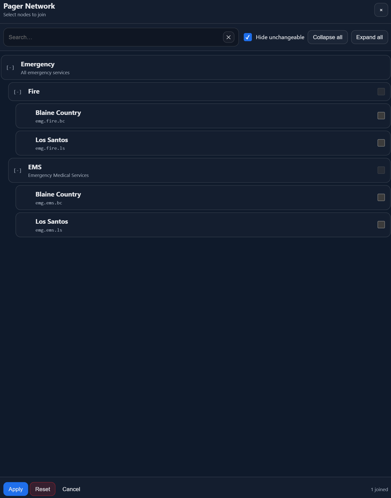
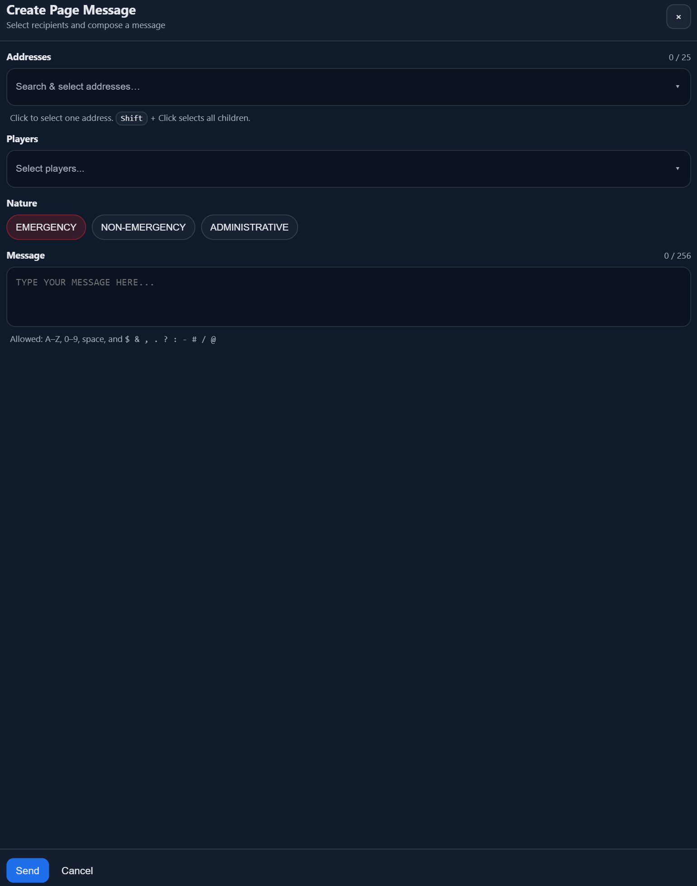
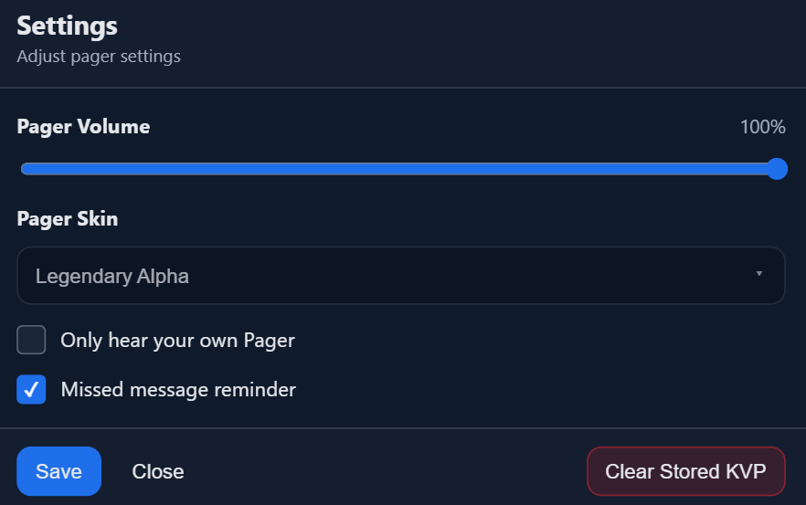

# Quick Start Guide

This page serves as a quick start guide to Pager Reborn.

## Open the Pager
Type `/pager` to open the Pager UI. You can also set a keybind:

Pause Menu → Settings → Key Bindings → FiveM → "Open Pager" → Assign a key.  
Once you have assigned a key, you can use it like so:

- **Tap**: Tapping the key will open the Pager.
- **Short Hold**: Holding the key for ~1 second then releasing will silence the pager, if it is alerting.
- **Long Hold**: Holding the key for more than ~2 seconds will open the Pager but allow you to keep moving and looking around.
  - The Pager will remain open until you release the key.

With the Pager open, pressing the `Home` key will toggle Big Mode. When not in Big Mode, the Pager can be dragged around the screen with the mouse and zoomed in or out with the mouse scroll wheel. If `Left Shift` + `Home` is pressed, the Pager will return to the default position in the bottom right of the screen. Pager position and zoom level are saved across sessions.

## Joining Capcodes
Type `/pager capcodes` to open the Capcode Selection UI.

The capcodes listed will change depending on the server. Some servers will control which capcodes you can join, and this list may be empty. To view the entire network regardless, untick 'Hide unchangeable', which will show all capcodes regardless of whether you have permission to join them or not.

## Creating a Page
Type `/pager new` to open the Page Creation UI.

To access this UI, you will need permission to page at least one address, as well as the [permissions to page one of the Natures](../config.md#permissions). To send a message directly to a specific player requires a [different permission](../config.md#page-any-player) again. After selecting Addresses and/or Players, select the Nature, enter a message, and then click 'Send'.

## Pager Settings
Type `/pager settings` to open the Pager Settings UI.

From this UI you can change the master volume of all Pager alert sounds, and also clear KVP data. Clearing the stored KVP data will delete all stored page messages, alert settings, NUI Position, and NUI volume.
