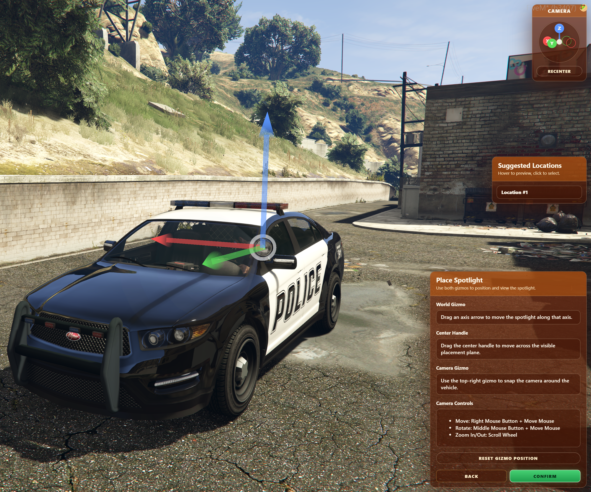

import ImageComparison from '@site/src/components/ImageComparison';
import volumetricLightingAfter from './assets/changelog/vol_after.png';
import volumetricLightingBefore from './assets/changelog/vol_before.png';

# Changelog

This page documents the changes made to Spotlight.

## v1.1.\*

### v1.1.0 - TBC

:::danger
v1.1.0 has several breaking changes, see the [Migration Guide](migration.md) for info on how to upgrade from v1.0.5 → v1.1.0.
:::

**Added**:
- [ACE permissions](config.md#permissions).
	- `InfernoSpotlight.UseSpotlight` controls ordinary spotlight use.
	- `InfernoSpotlight.Tool` controls access to the placement/editor tool.
- Volumetric lighting to spotlights.
  <ImageComparison before={volumetricLightingBefore} after={volumetricLightingAfter} />
- Multi-language support, [see here](../../translations/spotlight.mdx) for more info.
- `editable` chat suggestions under `editable/client/chat.lua`.
- Ability to aim spotlights up and down, in addition to left and right.
- Smooth spotlight moving when aim changes from one extreme to another.
  - I.e., if pointed all the way left, then aimed all the way right, will not smoothly move to new position.
- Complete in-game [Spotlight configuration and placement tool](developers/tool.md).
  
  - Supports [creating new spotlights](developers/tool.md#create-a-new-spotlight) and [editing existing ones](developers/tool.md#edit-an-existing-spotlight).
  - Supports vehicle extras, vehicle modkits, and persistent spotlights.
  - Shows a live preview of vehicle extras/modkit variants during setup.
  - Interactive 3D placement gizmo for positioning spotlights on vehicles.
    - Includes an orbiting editor camera with mouse movement, rotation, zoom, direction snapping, reentering, smooth transitions, and vehicle-relative positioning.
    - Suggested spotlight locations can be previewed and selected, based on position of vehicle `extralight_*` bones.
  - Configurable optional spotlight appearance.
    - RGB light color, brightness, radius, fall-off, inner and outer cone, minimum and maximum movement angles, and linking to highbeams.
- Spotlight configuration workflow improvements.
  - Save drafts directly to the server (saves to `draft-spotlights.json`), or view and copy JSON from in-game.
  - Load drafts from:
    - The live spotlights file (`spotlights.json`).
    - The draft file (`draft-spotlights.json`).
    - Or paste JSON directly in-game.
- Config option to disable spotlights on vehicles not defined in `spotlights.json`, for more info [see here](config.md#disable-fallback).

**Changed**:
- Config from JSON to CFG:
  - The `config.json` has been replaced with `config.cfg`.
  - Configured spotlights no longer reside in the config, and are now stored in `spotlights.json`.
- Improved server-side validation checks to catch cheaters.
- The secondary key is now a configurable FiveM keybind, like the primary key. Its default is `LSHIFT`. For more info, [see here](config.md#default-secondary-keybind).

**Fixed**:
- A vehicle's roll (left/right lean) not being factored into spotlight aim.
- Issue where empty data would be written to entity statebags when it didn't need to be.
- Issue where spotlight position changed after a player who had previously controlled a different spotlight, entered a vehicle with a spotlight enabled by a different player.

**Removed**:
- `VehicleSpotlightIgnores` config option.
  - To ignore a vehicle entirely, add it to [`ic_spot_ignoredVehicles`](config.md#ignored-vehicles), otherwise use the [Spotlight Tool](developers/tool.md) to add it manually.
- `VehicleCustomRGB` config option.
  - Spotlight colors can now be configured per-vehicle in the [Spotlight Tool](developers/tool.md).
  - To define a default color for all vehicles, update [`ic_spot_defaultSpotlightConfiguration`](config.md#default-spotlight-configuration) 

## v1.0.\*

### v1.0.5 - 02/03/2026
**Added**:
- Support for `EnableHighBeams` for all spotlight types.
  - Adding `"EnableHighBeams": true` to a config entry will turn on vehicle high beams with the spotlight.
    - Note: Only works for driver's side spotlights.
- [`IgnoredVehicleClasses`](config.md#ignored-vehicle-classes) and [`IgnoredVehicles`](config.md#ignored-vehicles) config options. See [here](config.md#ignored-vehicle-classes) and [here](config.md#ignored-vehicles) for more info.
  - [`IgnoredVehicleClasses`](config.md#ignored-vehicle-classes) disallows listed vehicle classes from using spotlights. 
  - [`IgnoredVehicles`](config.md#ignored-vehicles) disallows listed vehicles from using spotlights. 

### v1.0.4 - 12/05/2025
**Added**:
- Support for custom spotlight colors with RGB overrides, [see here](config.md#per-spotlight-configuration) for more info.
  - Allows changing the spotlight color with RGB on a per model basis.
  - Where no custom color exists, the default spotlight color will be used.

### v1.0.3 - 11/21/2025
**Added**:
- Support for [Persistent Spotlights](config.md#persistent-spotlights). [See here](config.md#persistent-spotlights) for more info.
  - For vehicles that have spotlights permanently modeled, and cannot be toggled with extras or mod kits.
- `To Console` button to the [Placement Tool](developers/index.md), that pastes the current offset to the F8 Console for easy selection and copying.

**Fixed**:
- Rounding error in the `Z` value of the [Placement Tool](developers/index.md), resulting in values being shown as whole numbers (i.e. `1`) instead of with decimals (i.e. `0.456`).

### v1.0.2 - 07/29/2025
**Added**:
- Support for automatic updating of vehicle mod kits on configured vehicles.
  - Identical to the feature that sets the correct vehicle extra based on spotlight on/off state, but for mod kits. [See here](config.md#vehicle-modkits) for more info.
- Support for spotlights on mod kits that don't have a spotlight bone of their own.
  - Using the new Placement Tool, you can now manually add a spotlight for a vehicle mod kit that doesn't already have a spotlight. [See here](developers/index.md#server-owners--developers) for more info.

**Changed**:
- `/spotlight debug` now also shows relevant vehicle bones alongside spotlight positions.

### v1.0.1 - 07/23/2025

**Added**:
- `/spotlight debug` command.
  - Used to visualize the positions of spotlights on vehicles, and get spotlight indices.
- `VehicleSpotlightIgnores` config option.
  - Used to tell the resource to ignore specific spotlights on specific vehicles.

### v1 - 07/11/2025
Resource release.

**YouTube Video**:
<iframe width="560" height="315" src="https://www.youtube.com/embed/aR8QT05UrMQ?si=SnQqYDKowGBkGMkh" title="YouTube video player" frameborder="0" allow="accelerometer; autoplay; clipboard-write; encrypted-media; gyroscope; picture-in-picture; web-share" referrerpolicy="strict-origin-when-cross-origin" allowfullscreen></iframe>
