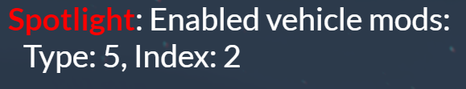
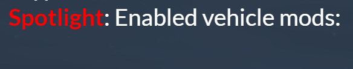
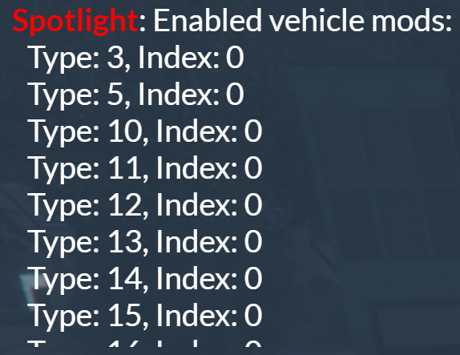
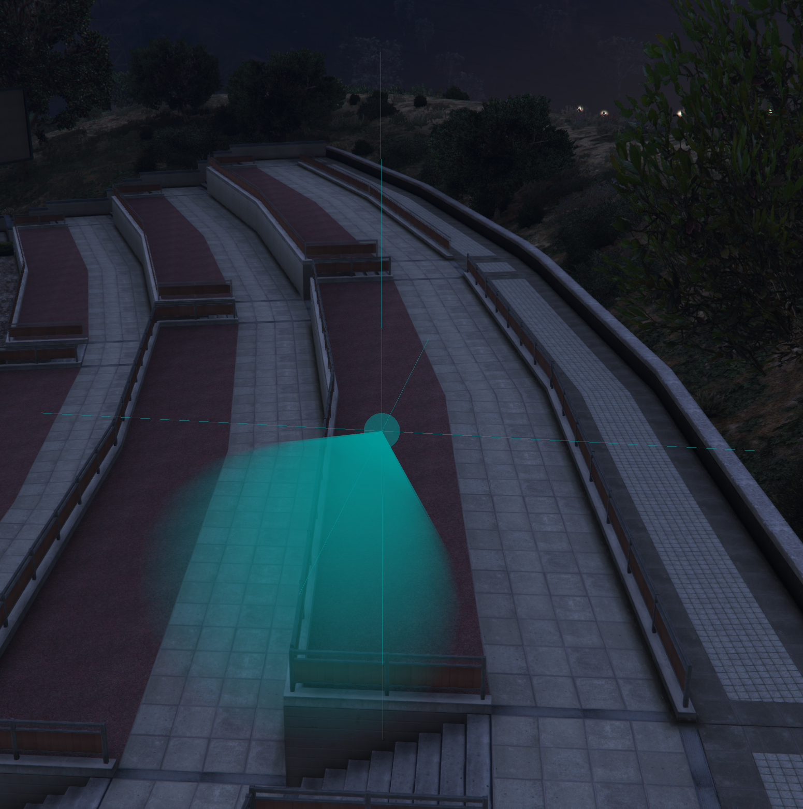
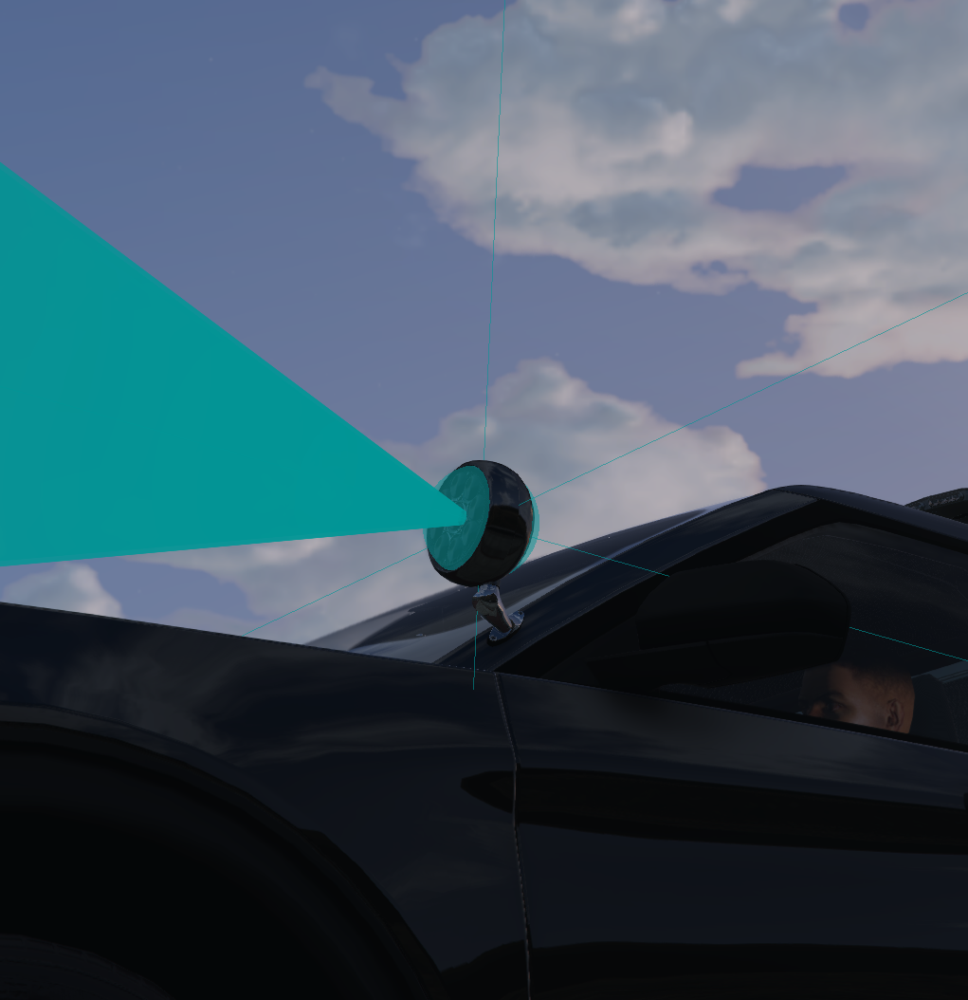
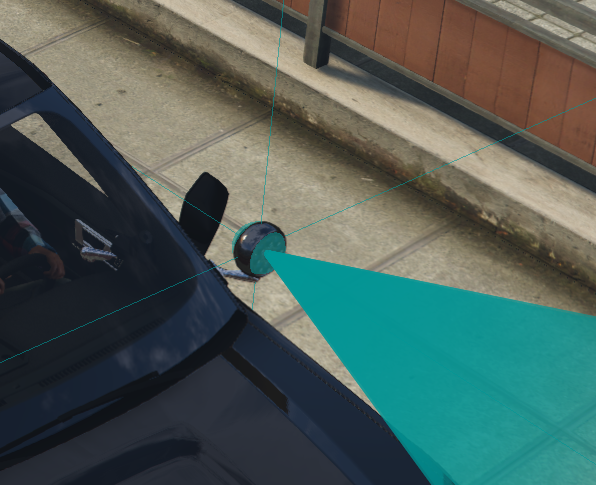
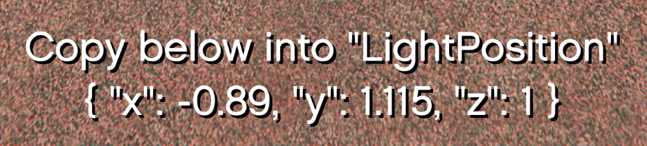
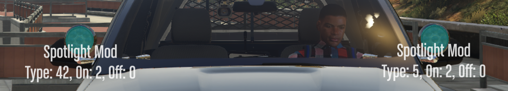
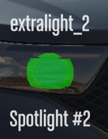
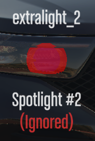

# Developers

## Vehicle Creators
The make a vehicle compatible with Spotlight, ensure that all spotlights modeled onto the vehicle make use of `extralight_1` through `extralight_4` for their illumination, and that they turn on with the vehicle's high-beams.

## Server Owners / Developers
If your vehicle(s) do not have an existing functional spotlight via an `extralight_*` bone, the resource will not automatically be able to determine the position of the spotlight.

However, the resource still supports manual configuration for vehicles with spotlights added via mod kits, or that are attached permanently - follow the steps below to add a vehicle.

### In-game steps
#### Mod Kits
Firstly, spawn the vehicle you want to use, and ensure all mod kits are removed.  
Once you've done this, add only the mod kit for the spotlight you want to add.

:::tip
If your vehicle has the driver and passenger spotlights under different mod kit types, add them separately to avoid confusion.
:::

Once your mod kit is set, type the following command: `/spotlight modkits`.  
In your chat you should see a message similar to the following:



:::note
If your chat looks like the below, you do not have any mod kits enabled.



If your chat looks like the below, you have other random mod kits enabled, and you need to remove them.


:::

Take note of the `type` and the `index`, then repeat the process for the flipped variant.  
The `type` will remain the same, but the `index` will change.

:::note
If your vehicle doesn't have a flipped down variant, you can use the same `index` twice.
:::

#### Spotlight Placement
Type the following command: `/spotlight tool` - this will enable the placement tool and draw a 3D "cross", cone, and sphere.



The purpose of these lines and shapes is to help you position where the spotlight's light will be drawn from on the vehicle.  
The easiest way to use the tool is the face the camera such that the hood of the vehicle is closest to you, and the trunk is furthest away.  
Then use the controls in the top left of your screen to position the blue sphere inside your spotlight.  
The start of the cone should just be touching the spotlight.

:::tip
Use `Left Control` and `Left Shift` to slow down or speed up the movement.
:::

|  |  |
|------------------------------------------------------|------------------------------------------------------|

Once positioned, take note of the text at the bottom of your screen.



You can also press `Enter` to have the values pasted in your F8 Console, which you can select and copy from.

### Configuration Changes
Inside your `config.cfg`, locate the `VehicleMods` or `VehiclePersistents` section.  
Copy the snippet below and paste as a new entry in the array.

:::warning
JSON syntax is important: missing `,`s, `[]`s, etc. will break the file. Check your JSON syntax with [this website](https://jsonformatter.org/).
:::

#### Vehicle Mods (Mod Kits)

```json
{
  "ModelName": "police_car",
  "DriversSide": true,
  "ModType": 1,
  "DisabledMod": 0,
  "EnabledMod": 1,
  "LightPosition": { "x": 1.0, "y": 1.0, "z": 1.0 }
}
```

Once pasted, update the values to the ones you noted down previously.

- `ModelName`
  - The model name of the vehicle.
- `DriversSide`
  - If this spotlight is on the driver's side (`true`), or the passenger side (`false`).
- `ModType`
  - This is the first number (`Type: x`) from the chat.
- `DisabledMod`
  - This is the second number (`Index: 0`) from the chat.
  - This should be the flipped down variant.
- `EnabledMod`
	- This is the second number (`Index: 0`) from the chat.
	- This should be the flipped up variant.
- `LightPosition`
  - This is the text from the bottom of your screen from the placement tool.

#### Vehicle Persistents (Permanent Spotlight)

```json
{
	"ModelName": "police_car",
	"DriversSide": true,
	"LightPosition": { "x": -0.815, "y": 1.135, "z": 0.435 }
}
```

Once pasted, update the values to the ones you noted down previously.

- `ModelName`
	- The model name of the vehicle.
- `DriversSide`
	- If this spotlight is on the driver's side (`true`), or the passenger side (`false`).
- `LightPosition`
	- This is the text from the bottom of your screen from the placement tool.

***

Save your changes, restart the resource, and you should be good to go.  
If you're struggling, [join our Discord](https://inferno.codes/discord) for help.

You can check the configuration position of spotlights at any time using the command: `/spotlight debug`



### Notes
#### Conflicting `extralight_*`
Some vehicles will use `extralight_*` bones in the headlights, or elsewhere on the vehicle, not part of the spotlights.  
You can check/view these bones using the command: `/spotlight debug`

Example of an incorrectly detected spotlight:



To fix this, add an entry in the `VehicleSpotlightIgnores` section of the config. [See here](../config.md#spotlight-ignoring) for more info.



The resource will now not treat that specific `extralight_*` bone as a spotlight.
