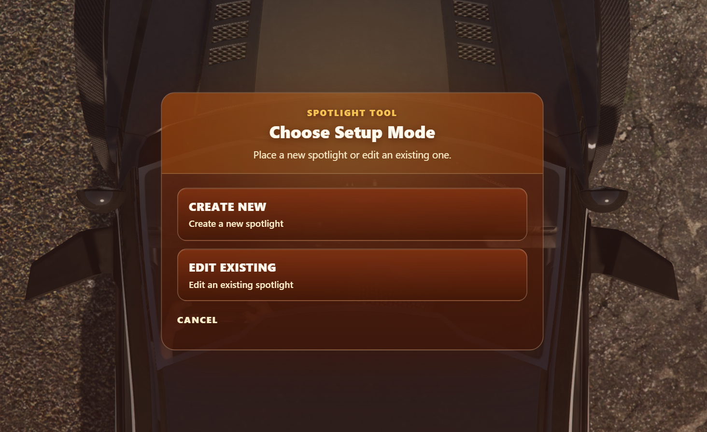
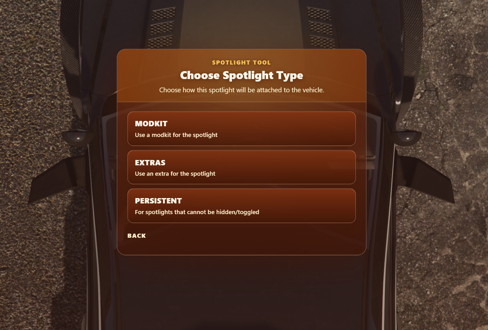
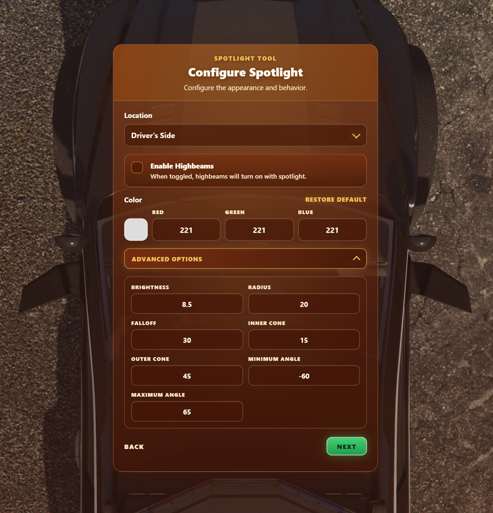
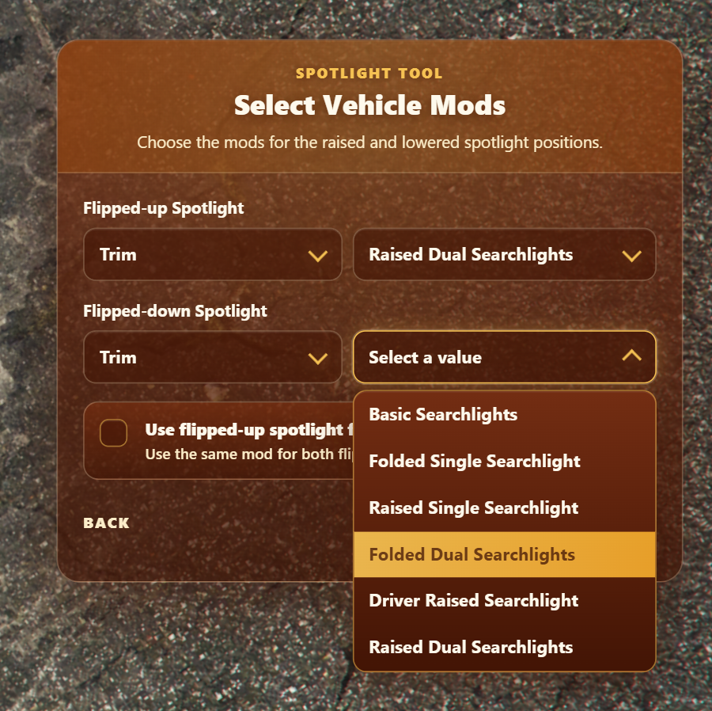
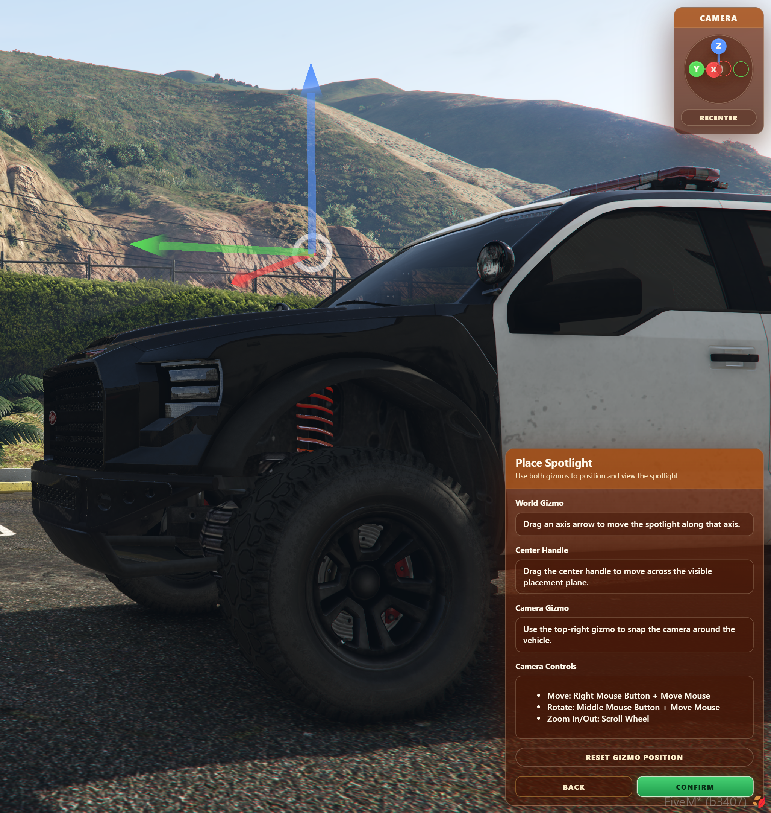
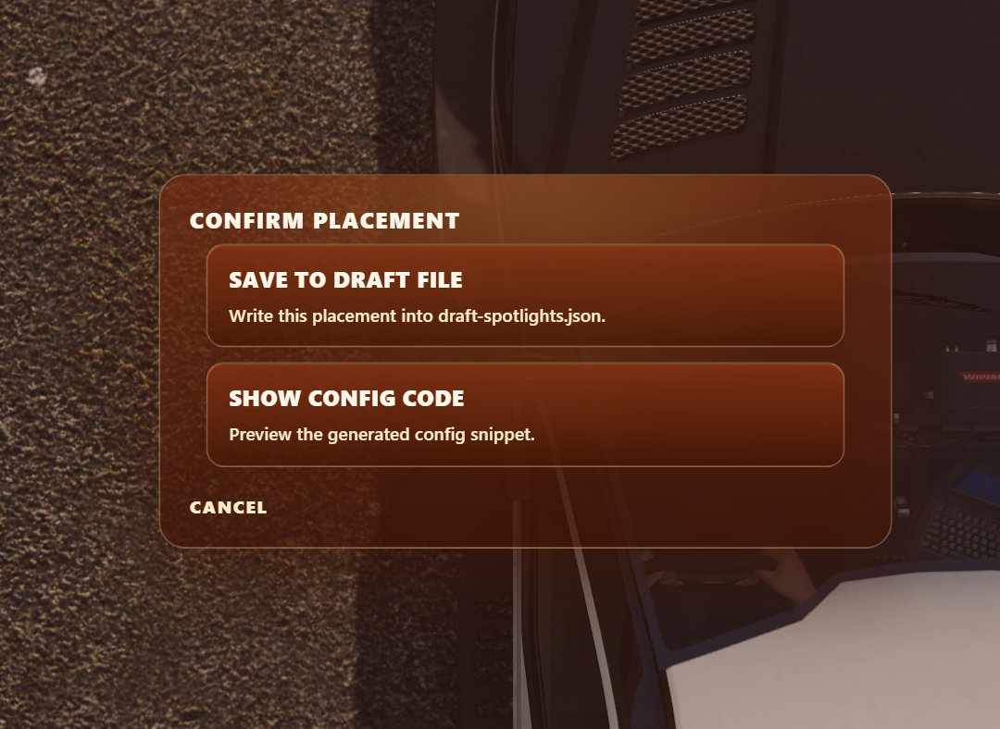
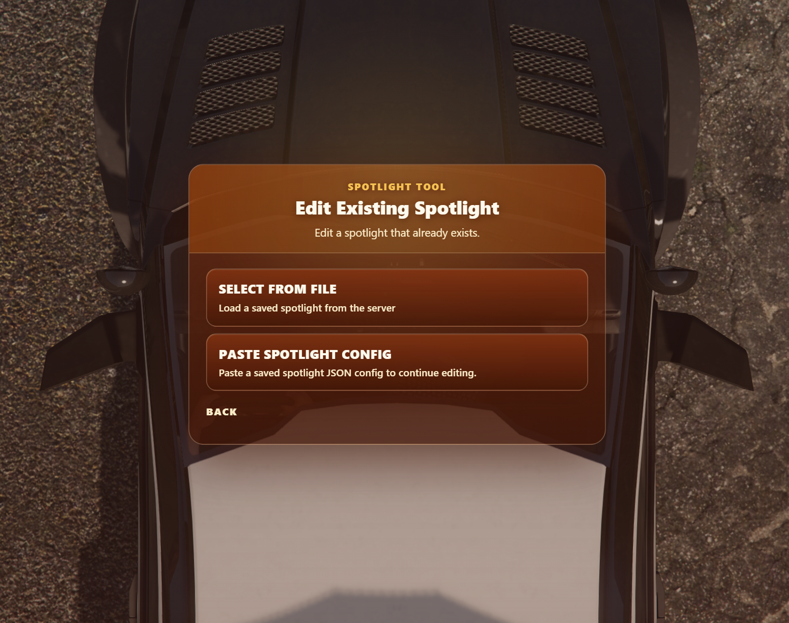

# Spotlight Tool

The Spotlight Tool is an in-game editor for creating and editing vehicle spotlight definitions. It guides you through selecting the spotlight type, configuring its appearance, placing its light source, and exporting or saving the finished definition.

The tool creates entries for [`spotlights.json`](../config.md#spotlight-definitions). You do not need to find modkit IDs, copy coordinates from the console, or build JSON by hand (unless you want to).

## Before You Start

1. Ensure you have the [`InfernoSpotlight.Tool`](../config.md#use-spotlight-tool) ACE permission.
2. Spawn the vehicle you want to configure and sit inside it.
3. Run `/spotlight tool`. If you changed [`ic_spot_command`](../config.md#command), replace `spotlight` with your configured command name.

:::note
The tool uses the vehicle you are currently sitting in. It cannot be opened while on foot. Also, the tool will automatically change the vehicle appearance.
:::

## Create a New Spotlight

Select **Create New**, then choose how the spotlight is attached to the vehicle:

- **Modkit** - use vehicle mods for the raised and lowered spotlight states.
- **Extras** – use vehicle extras for the raised and lowered spotlight states.
- **Persistent** – use a spotlight permanently modelled on the vehicle, with no extra or modkit changes.

### Configure the Spotlight

Choose whether the spotlight belongs to the driver's or passenger's side, then optionally configure its appearance and behavior.

- Enable **Highbeams** to turn the vehicle high beams on with this spotlight.
- Choose a colour with the colour picker or individual RGB values.
- Select **Restore Default** to return the colour to the server default.
- Open **Advanced Options** to change brightness, radius, falloff, inner and outer cone angles, and the minimum and maximum movement angles.

Any values left at their defaults inherit from [`ic_spot_defaultSpotlightConfiguration`](../config.md#default-spotlight-configuration) when the configuration is generated.

### Select Extras or Modkits

For **Extras**, select the extra for the raised spotlight and the extra for the lowered spotlight. The vehicle previews each selection as you choose it.

For **Modkits**, first select a mod type, then select its value for both the raised and lowered states. The tool fetches compatible modkits from the current vehicle and previews the selected mod.

If the vehicle has no separate lowered state, enable **Use flipped-up spotlight for both**. This uses the raised extra or modkit for both states.

:::tip
You can configure driver-side and passenger-side spotlights as separate definitions for the same vehicle.
:::

## Place the Light Source

After completing the setup steps, select **Next** to enter placement mode. The editor opens an orbiting camera and a 3D world gizmo centred on the vehicle.

:::tip
On some larger vehicles, the gizmo may be hidden inside the vehicle while looking from the default top-down view. To resolve this, change the camera's view angle either via the options in the top right, or using the mouse.
:::

### Suggested Locations

If the vehicle exposes `extralight_*` bones, the tool lists them as suggested locations.

- Hover a location to preview it on the vehicle.
- Select a location to move the placement gizmo there.
- Use **Reset Gizmo Position** to return to the default position.

Suggested locations are starting points only; you can refine them with the gizmo.

### Move the Gizmo

Drag an axis arrow on the world gizmo to move the light source along that vehicle-relative axis. Drag the centre handle to move it across the visible placement plane.

Position the gizmo at the point where the spotlight beam should originate. The placement stays relative to the vehicle, so it remains correct when the vehicle is moved or rotated.

### Control the Camera

Use the placement camera to inspect the vehicle from every angle:

- **Move:** hold the right mouse button and move the mouse.
- **Rotate:** hold the middle mouse button and move the mouse.
- **Zoom:** use the scroll wheel.
- **Direction snapping:** select an axis on the camera gizmo to snap to a vehicle-relative view.
- **Recenter:** select **Recenter** to return the camera to its default view.

The camera transitions smoothly between snapped views and follows the vehicle's orientation.

## Confirm Placement

Select **Confirm** when the light source is correctly positioned. Choose one of the following options:

- **Save to draft file** - saves the definition server-side in `draft-spotlights.json`.
- **Show config code** - displays the generated JSON definition and provides a **Click to Copy** button.

If a draft already exists for the same vehicle and side, the tool asks you to explicitly confirm before overwriting it.

:::warning
`draft-spotlights.json` is a working file. Review the generated definition and copy it into the appropriate `extras`, `mods`, or `persistents` list in `spotlights.json` when it is ready for use.
:::

:::tip
You can use the **Show config code** option to copy the generated JSON definition to the clipboard, and then go back and also save the spotlight to the `draft-spotlights.json` file, but once saved to the draft file, you cannot view the config code again.
:::

## Edit an Existing Spotlight

Select **Edit Existing** from the opening screen, then choose one of two sources:

- **Select from File** - loads definitions for the current vehicle from both live `spotlights.json` and `draft-spotlights.json`.
- **Paste Spotlight Config** - paste a single generated spotlight JSON definition.

After selecting or pasting a definition, update its settings, extras or modkits, and placement just as you would when creating a new spotlight.

## Troubleshooting

### I cannot open the tool

Confirm that you are seated in a vehicle and that your player has the [`InfernoSpotlight.Tool`](../config.md#use-spotlight-tool) ACE permission.

### No extras or modkits are listed

The tool can only offer extras or modkits available on the vehicle you are currently using. Try the correct vehicle variant and verify that its extras or modkit slots are present.

### The spotlight is in the wrong location

Reopen the tool, select **Edit Existing**, then load the definition from the live file, draft file, or pasted JSON. Adjust the placement gizmo and export or save the updated definition.

### My saved draft is not active in-game

Drafts are saved to `draft-spotlights.json`, not the live `spotlights.json` file. Copy the reviewed definition into `spotlights.json` and restart the resource.
