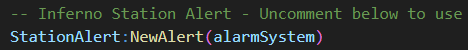
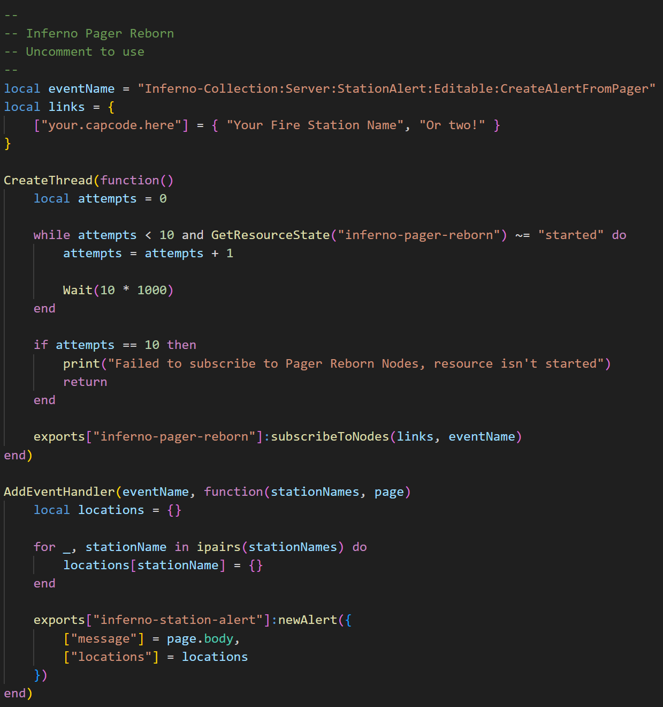

# First-Party Resources
This page explains how to integrate SA with first-party resources (other Inferno Collection resources).

:::tip
First-party resource integrations only work with the [Standalone Version](../index.md#station-alert-1) of SA.
:::

## Fire Alarm Reborn
Follow the steps below to create alerts when a fire alarm is activated.

1. Inside `inferno-fire-alarm-reborn`, open `editable/server/events.lua`.
2. Locate the `Inferno Station Alert - Uncomment below to use`, then uncomment (remove the `--`) the section below.
   

You can customize the `exports` to your liking by editing `editables/server/station-alert.lua`. For more information on `exports`, see [here](exports/server.md).

## Pager Reborn
There are two options for integrating Pager Reborn:
- Station Alert triggers Pager Reborn
- Pager Reborn triggers Station Alert

The two systems are complementary and can be used together to serve different purposes.

### Station Alert → Pager Reborn
This setup is designed such that Station Alert stations/locations can "trigger" (page) Pager Reborn Nodes. For example, an external resource triggers a station alert; SA can then activate the pagers of all players within the radius of the fire station.

To enable this kind of integration, [see here](../../pager-reborn/developers/first-party.md#station-alert--pager-reborn).

### Pager Reborn → Station Alert
This setup is designed such that Station Alert stations/locations can "listen in" (subscribe) to existing Nodes on Pager Reborn. For example, you might design your Pager Network such that each Fire Station has its own Node. Then to activate a station alert, you would only need to page that station's Node. Another example would be subscribing all fire stations to all fire-related nodes, so that all stations activate for all calls.

Follow the steps below to enable this functionality:

1. Inside `inferno-station-alert`, open `editable/server/events.lua`.
2. Locate the `Inferno Pager Reborn`, then uncomment (remove the `--`) the section below.
   
3. Update `links` as needed, where the key is the capcode address and the value is the station name.

You can customize the `exports` to your liking. For more information on `exports`, see [here](exports/server.md).
