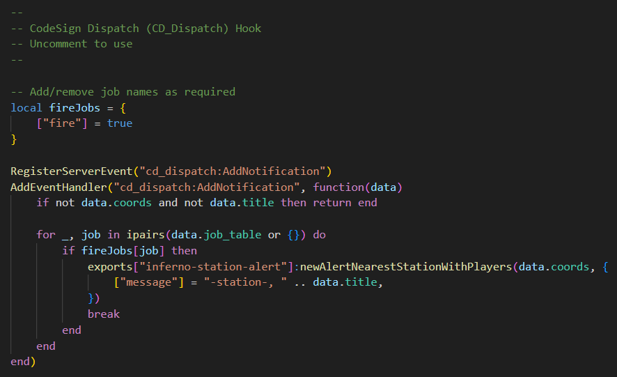
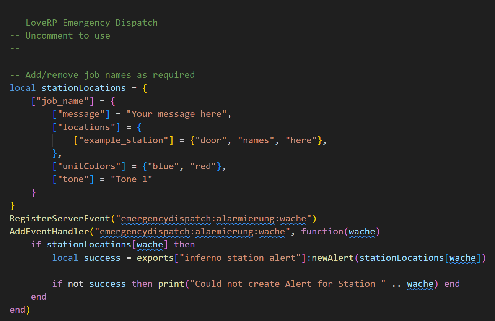
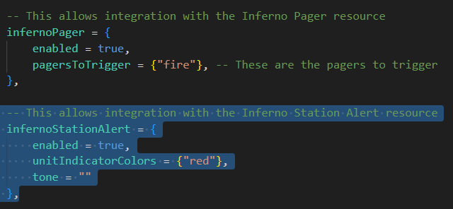
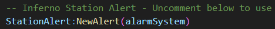

# Third-Party Resources
This page explains how to integrate SA with third-party resources.

:::tip
Third-Party Resource Integrations only work with the [Standalone Version](../index.md#station-alert-1) of SA.
:::

## zFires
Follow the steps below to create alerts when a player started fire is created, and when automatic incidents are created.

1. Inside `z_fire`, open `core/config.lua`.
2. Locate `integrations = {...}`, then find `['infernoStationAlert'] = false` and change to `true`.
    

You can customize the `exports` to liking, see [here](exports/server.md) for more information.

## CD_Dispatch
Follow the steps below to create alerts when a new notification is created for one or more specific jobs.

1. Inside `inferno-station-alert`, open `editable/server/events.lua`.
2. Locate the `CodeSign Dispatch (CD_Dispatch) Hook`, then uncomment (remove the `--`) the section below.
   
3. Update `fireJobs` with the names of jobs you would like to use for alerts.

You can customize the `exports` to liking, see [here](exports/server.md) for more information.

## Emergency Dispatch
Follow the steps below to create alerts when a new notification is created for one or more specific stations.

1. Inside `inferno-station-alert`, open `editable/server/events.lua`.
2. Locate the `LoveRP Emergency Dispatch`, then uncomment (remove the `--`) the section below.
   
3. Update `stationLocations` as you wish.

You can customize the `exports` to liking, see [here](exports/server.md) for more information.

## Smart Fires
Follow the steps below to create alerts when a player started fire is created, and when automatic fires are created.

1. Inside `SmartFires`, open `config.lua`.
2. Locate `infernoStationAlert = {...}`, and set `enabled` to `true`, then edit `unitIndicatorColors` and `tone` as you wish.
   
   - Leaving `tone` empty will use the default tone.
   - Set `unitIndicatorColors` to `{}` to not have any colors.

You can customize the `exports` to liking, see [here](exports/server.md) for more information.

## Fire Alarm Reborn
Follow the steps below to create alerts when a fire alarm is activated.

1. Inside `inferno-fire-alarm-reborn`, open `editable/server/events.lua`.
2. Locate the `Inferno Station Alert - Uncomment below to use`, then uncomment (remove the `--`) the section below.
   

You can customize the `exports` to liking by editing `editables/server/station-alert.lua`. For more information on `exports`, see [here](exports/server.md).

## Sonoran CAD
To connect Sonoran CAD and Inferno Collection, ensure that Sonoran CAD starts before SA does.  
When SA connects with Sonoran CAD, you will see a log entry in the console:

```
Sonoran CAD detected
```

### Per-Station Icons
It's possible to change the icons that appear in Sonoran CAD on a per-station basis; this requires manually adding an extra value to each desired system in a draft file.  
For example, you might use a "fire" icon for Fire Stations, and an "ambulance" icon for Ambulance Stations.


To add an icon, open the draft file and locate the `location { ... }` line.  
On the same line, within the `{ }`, add `icon = "..."`, where `...` is your icon.

Icons can be either:

- A Font Awesome Icon (v6 Free)
  - [See here](https://fontawesome.com/v6/icons?ic=free) for list of icons.
  - Only the name is required, not the full HTML.
    - Example: If the HTML is `<i class="fa-solid fa-house"></i>`, the icon would be `fa-solid fa-house`.
- A valid URL for a remote image
  - Valid in this context means an HTTPS url (not HTTP), and leading to an image file.
  - URL must be remote (i.e., accessible over the internet), not local to the server (i.e., located in the resource).
    - Example: `https://example.com/some/path/to/your/image.png`

Examples:

```lua
location { name = "Davis Fire Station", icon = "fa-solid fa-house-fire" }

...

location { name = "Sandy Shores Fire Station", icon = "fa-solid fa-dumpster-fire" }

...

location { name = "Paleto Bay Fire Station", icon = "https://example.com/some/path/to/your/image.png" }
```
