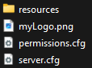

# Tool

This page explains how to create/edit station locations with the SA Tool.

The SA Tool is a powerful in-game feature that allows server owners to create new and edit existing station locations directly from their server.

When using the SA Tool, drafts are saved directly to the server's files, so server owners can delegate creation of station locations to trusted players without having the worry about the hassle of needing to send each other files.

Watch the [YouTube Video](https://www.youtube.com/watch?v=V0MBgqLFetA&t=641s) for SA Tool.

**YouTube Videos**:
<iframe width="560" height="315" src="https://www.youtube.com/embed/V0MBgqLFetA?si=3ai-Is13o3te9z66&amp;start=641" title="YouTube video player" frameborder="0" allow="accelerometer; clipboard-write; encrypted-media; gyroscope; picture-in-picture; web-share" referrerpolicy="strict-origin-when-cross-origin" allowfullscreen></iframe>
<iframe width="560" height="315" src="https://www.youtube.com/embed/wypQ19zgBWA?si=8s8A4B3096R8gCOh" title="YouTube video player" frameborder="0" allow="accelerometer; clipboard-write; encrypted-media; gyroscope; picture-in-picture; web-share" referrerpolicy="strict-origin-when-cross-origin" allowfullscreen></iframe>

:::tip
You must be in first-person to use the SA Tool.
:::

## First-Time Use

The very first time the SA Tool is used on your server, it will create a new directory in the root of your server files, this is *generally* the same location as your `resources` folder and `server.cfg` file, see the example below:



If you are ever unsure, you can use the `/stationalert path` command from your server console, it will tell you exactly where the directory is located.

## Drafts

### Creating a new Draft

To create a new draft, use the `/stationalert tool new` command.

### Editing an existing Draft

To edit an existing draft, use the `/stationalert tool` command, then make a selection from the list.

:::note
If a new draft is created automatically, then there are no drafts in your draft's directory.
:::

### Saving a Draft

If you created a new draft, you will need to give the draft a name, do this by using the `/stationalert tool <draft_name_here>` command (`<>` not required).

If you are editing an existing draft, you only need to type `/stationalert tool`.

### Discarding a Draft

If you wish to *not* save changes to a draft, you can use the `/stationalert tool cancel` command.

:::danger
This will immediately and irreversibly discard the changes you have made, and you cannot get them back.
:::

### Deploying a Draft

To deploy a draft as Station Location, you will need to copy the file from the Drafts folder and place it inside another FiveM resource.  
The draft can be placed in either an existing resource, or a new one, so long as this line is added at the bottom of the `fxmanifest.lua`:

```lua
locations "your_first_draft_name_here.lua"
locations "your_second_draft_name_here.lua"
locations "your_third_draft_name_here.lua"
```

:::note
Drafts cannot be placed in the Station Alert resource.
:::

Making sure to replace `your_draft_name_here` with the name of the draft `.lua` file.

Below is an example of a full `fxmanifest.lua`:
```lua showLineNumbers
fx_version "cerulean"
game "gta5"

locations "davis.lua"

dependency "inferno-station-alert"
```

:::tip
Resources with Draft Locations inside them must be started *after* Station Alert, or they will not be loaded.  
Either add `dependency "inferno-station-alert"` to the manifest, or update your resource start order.
:::

## In-Game Tool

### Controls 

Below you will find the controls for the SA Tool. They will also display in the top left of your screen.


In addition to the above, there are the following:

#### Arrow Keys
The Left and Right arrow keys will rotate the current prop left or right.  
The Up and Down arrow keys will move the current prop closer or further away from you.

:::tip
Holding Left Shift will increase the increment of the above changes.
:::

#### Left Mouse Button

If the bottom of your screen starts with `Place a`, then this will create a new prop of the type you have selected.

If it says `Hide a Prop`, then this will hide the prop highlighted in orange. [See here](#hidden-props).

:::tip
When looking at a previously placed prop (will have a white circle around it), you can Left-Click to move it to a new location.
:::

:::warning
Placing too many Ceiling Speakers can result in very loud, overlapping audio.  
We suggest placing one speaker every 5-10 meters.
:::

#### Right Mouse Button

If the bottom of your screen starts with `Place a`, then this will delete the selected prop.

If it says `Hide a Prop`, then this will unhide the selected prop.

#### Scroll Wheel

This changes between all the prop types, as well as the `Hide a Prop` option.

#### Tilda ( ` )

This creates a new station location.  
You must do this before you are able to place any props.

:::tip
You can have multiple station locations in a single draft.
:::

#### 1 (One)

This cycles through created station locations inside this draft file.

:::warning
If you see the warning below at the bottom of your screen, you are too far from your station location.


:::

### Hidden Props
When a prop is hidden with the SA Tool, it will not appear in-game. The intention is to allow server owners to remove props that conflict with SA and replace them with SA props.

For example, if you have a MLO you purchased on Tebex, and it contains non-functional warning lights outside the building, you could hide these and replace them with SA Wall Lights.

### Coloured Radii
When in the tool, you may notice coloured radii (or circles) - these represent the approximate range of placed Speakers.  
The aim is to help prevent excess overlap of speakers, and aid in proper coverage of stations.

The colors will only appear when nearby to a Speaker.

### Base Game Traffic Lights
For info on what [Base Game Traffic Lights](../usage/components.md#base-game-traffic-lights) are, [see here](../usage/components.md#base-game-traffic-lights).

For a video demonstration, see the second YouTube video at the top of the screen.

To add Base Game Traffic Lights, select the option via the scroll wheel.  
Aim at a traffic light until it is highlighted, then select Green or Red from the menu.  
Selecting Red will turn this traffic light red when alerted, and will stop traffic.  
Selecting Green will turn this traffic light green when alerts, and keep traffic flowing.  
Aim at spot on the road where traffic should stop - generally, this is where traffic normally stops for a red light.

If you want to add another spot on the road (such as when there's multiple lanes), aim at the existing traffic light and left click.

### Addon Traffic Lights
For info on what [Addon Traffic Lights](../usage/components.md#addon-traffic-lights) are, [see here](../usage/components.md#addon-traffic-lights).

To add Addon Traffic Lights, select the option via the scroll wheel.  
Aim at the ground where you want the traffic light to go; the light will always face the player.
Once placed, aim at spot on the road where traffic should stop.

If you want to add another spot on the road (such as when there's multiple lanes), aim at the existing traffic light and left click.

## Adding Groups
A Group can be added on a per-system basis, and requires manually adding an extra value to each desired system in a draft file.

To add an icon, open the draft file and locate the `location { ... }` line.  
On the same line, within the `{ }`, add `group = "..."`, where `...` is your group.

```lua
location { name = "Davis Fire Station", group = "Los Santos" }
```

Groups can be used via the [`newGroupAlert`](exports/server.md#create-new-alert-for-group-of-stations) server export, [see here](exports/server.md#create-new-alert-for-group-of-stations) for more info.

## Adding Custom Data
Custom data can be added on a per-system basis, and requires manually adding an extra value to each desired system in a draft file.

To add custom data, open the draft file and locate the `location { ... }` line.  
On the same line, within the `{ }`, add `customdata = "..."`, where `...` is your custom data.

```lua
location { name = "Davis Fire Station", customdata = "Your Custom Data Goes Here!" }
```

Some example use cases for custom data include:
- Extra information to display on an MDT, Pager, CAD, etc., such as:
  - Gate codes, Alarm Panel Location, Safety Notes, etc.
- The type of station, e.g.:
  - Fire Station
  - Ambulance Station
  - Bush Fire Station
  - Etc.
- If the station should be alerted from other scripts
- Etc.

Custom data can be access from any script via `.customdata`. [See here](data.mdx#station-location) and [here](exports/server.md#get-all-locations-by-group) for more info.
