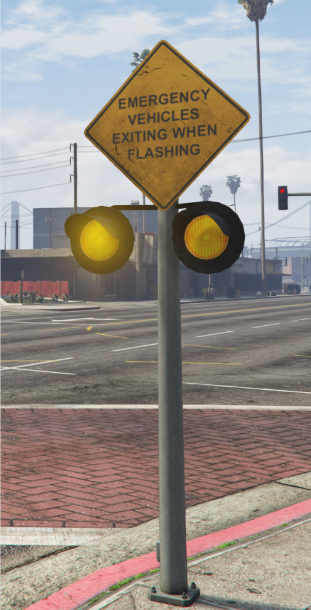

# Components

This page documents each component in SA and how to use them.

A component is any part of the Station, such as the Traffic Lights, Door Controls, etc.  
Not all components can be directly interacted with, but the ones that can will show a prompt in the top left of the screen where applicable.

:::note
Depending on how the [Ace Permissions](../config.md#permissions) are set up, not all the below options will be available to all players.
:::

## Door Controls
Door Controls allow players to open and close doors from a panel within the station.  
Door Controls can be placed anywhere, but we suggest placing them inside the room where the bays are.  
Door Controls can also be access from a Station Computer.

The Door Controls Menu allows players to:
- Open and close individual doors
- Open and close all doors
- Temporarily activate traffic lights
- Isolate doors
  - When a door is isolated, it will not open or close with other doors, and will remain "locked" in whatever position (open or closed) it was isolated in.

***

## Traffic Lights
Interior Traffic Lights are linked to a specific door, and will change color depending on the door's state.  
When a door is closed, it will be red. When a door is opening or closing, it will flash yellow. When a door is open, it will be green.

***

## Base Game Traffic Lights
Base Game Traffic Lights (not to be confused with [Interior Traffic Lights](#traffic-lights) or [Addon Traffic Lights](#addon-traffic-lights)), are existing props in the GTA World that can be added to SA.  
When added via the [SA Tool](../developers/tool.md), they can be forced to stay green or red for the duration of an Alert.  
This allows for Fire Appliances to exit a Station quickly, without getting stuck in traffic.

See the video below for more information.

**YouTube Video**:
<iframe width="560" height="315" src="https://www.youtube.com/embed/wypQ19zgBWA?si=8s8A4B3096R8gCOh" title="YouTube video player" frameborder="0" allow="accelerometer; clipboard-write; encrypted-media; gyroscope; picture-in-picture; web-share" referrerpolicy="strict-origin-when-cross-origin" allowfullscreen></iframe>

***

## Addon Traffic Lights
Addon Traffic Lights (not to be confused with [Interior Traffic Lights](#traffic-lights) or [Base Game Traffic Lights](#base-game-traffic-lights)), are props placed via the [SA Tool](../developers/tool.md).  
Once placed they can stop traffic in one or more locations - think an extension of [Base Game Traffic Lights](#base-game-traffic-lights), but placeable anywhere.  
This stops Fire Appliances getting stuck in their driveways because vehicles are stopped on the road in-front of them.

See the video below for more information.

**YouTube Video**:
<iframe width="560" height="315" src="https://www.youtube.com/embed/ezGdlphpJg0?si=qqfgW74iNxR-JU7P" title="YouTube video player" frameborder="0" allow="accelerometer; clipboard-write; encrypted-media; gyroscope; picture-in-picture; web-share" referrerpolicy="strict-origin-when-cross-origin" allowfullscreen></iframe>

***

## Warning Lights
Warning Lights are a cross between a road sign and a traffic light.  
The Warning Lights will flash yellow when a vehicle drives through an open door connected to a station.

:::note
[`ic_sa_closeDoorsOnDriveThrough`](../config.md#self-closing-doors) must be `true` for vehicle detection to work.
:::

***

## Station Computer
Station Computers are not standalone props, but instead a prop selected to act as a Computer.  
When nearby these props, a prompt will appear and players can access a menu.  
From the Station Computer menu, players can:
- Create new alerts
  - Create a new Alert at any Station Location.
- Create new messages
  - Plays a message over the station speakers and shows message on [Call Screens](#call-screens).
- Control doors
  - See [Door Controls](#door-controls).
- Activate a local station alert
  - Play a generic tone over the station speakers - designed for walk-in emergencies.
- Rename doors
  - Allows players to temporarily rename doors - such as if a truck is moved around - reverts after server restart.

***

## Ceiling Speakers
Ceiling Speakers are the sound sources for the 3D Audio played by SA.  
The speakers do not take walls into account, so placing a speaker inside a room will lead to people outside the room being able to hear it as well.

:::warning
Placing too many speakers can result in very loud, overlapping audio.  
We suggest placing one speaker every 5-10 meters.
:::

***

## Exterior Speakers
Functionally identical to [Ceiling Speakers](#ceiling-speakers), but designed to be placed outside.  
[See here](#ceiling-speakers) for more info.

***

## Lights
Lights are designed to be placed outside of Stations, and will flash when an Alert is received.  
They can be placed on walls or ceilings, as well as inside.

***

## Status Lights
Status Lights are designed to be placed outside of Stations, and will flash either red or green depending on the status of the Station.  
When an alert is received, the light will flash red. When a message is received, the light will flash green.

***

## Bollard Lights
Similar to Wall Lights, Bollard Lights are designed to be placed outside of Stations near roadways, and will flash when an Alert is received.

***

## Unit Indicators
Unit Indicators change color depending on what metadata was provided in an Alert.  
For example, medical calls could be blue, fire calls could be red, and everything else could be green.

Available colors:
- Red
- Green
- Blue
- Yellow
- Magenta

***

## Call Screens
Call Screens will display information about the Station they are located in, and if configured, the current time.  
When Alerted, they will change screens to display information about the current Alert, which doors are open and closed, and how long since the Alert was received.  
When a message (but not a full alert) is received, the screens will show just the message sent without the extra details (such as door states), then reset after 20 seconds.

:::warning
Restarting SA will cause the Call Screens to all go black. This is because of how FiveM un/loads the replacement asset, and we cannot fix this. If you need to restart the resource a lot (i.e. because you are developing/testing a custom call screen), we suggest moving the `xm_prop_x17_tv_ceiling_scn_02.ydr` file out of the `stream` folder temporarily. 
:::

***

## Dispatch Centers
Dispatch Centers are not a physical thing, but rather a concept. When you create a Station Location without any Lights or Doors, it is removed from the list of Station Locations that can receive an alert, however, they can still create alerts.  
As such, they become "Dispatch Centers": locations that can create, but not receive, alerts.
