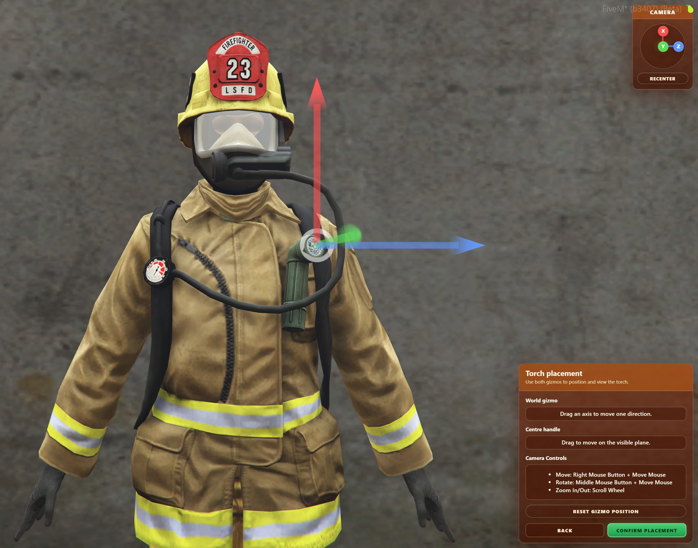
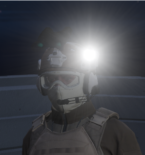
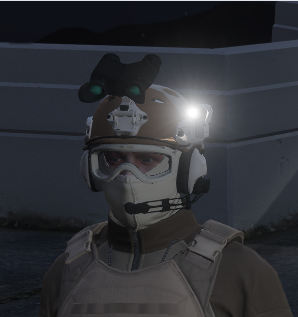

import ImageComparison from '@site/src/components/ImageComparison';
import moveAfter from './assets/changelog/move_after.webp';
import moveBefore from './assets/changelog/move_before.webp';
import drawAfter from './assets/changelog/draw_after.png';
import drawBefore from './assets/changelog/draw_before.png';

# Changelog

This page documents the changes made to Torches.

## v1.1.\*

### v1.1.0 - 08/26/2026

:::danger
v1.1.0 has several breaking changes, see the [Migration Guide](migration.md) for info on how to upgrade from v1.0.3 → v1.1.0.
:::

**YouTube Video**:
<iframe width="560" height="315" src="https://www.youtube.com/embed/nLG1o_E6ZBc?si=dO98ll3s2V365Ziy" title="YouTube video player" frameborder="0" allow="accelerometer; autoplay; clipboard-write; encrypted-media; gyroscope; picture-in-picture; web-share" referrerpolicy="strict-origin-when-cross-origin" allowfullscreen></iframe>

**Added**:
- [ACE permissions](config.md#permissions).
  - `InfernoTorches.UseTorches` controls ordinary torch use.
  - `InfernoTorches.Tool` controls access to the Torch Tool.
- Volumetric lighting to torches.
  <ImageComparison after={drawAfter} before={drawBefore} />
  <ImageComparison after={moveAfter} before={moveBefore} />
- Multi-language support, [see here](../../translations/torches.mdx) for more info.
- Complete reworking of in-game [Torch configuration and placement tool](developers/tool.md).
  
  - Supports creating and editing Ped and MP Ped presets.
  - Supports live preview of MP Ped clothing and prop variations.
  - Includes an interactive 3D placement gizmo and editor camera.
  - Can load existing presets from `torches.json` and `torches.draft.json`.
  - Can save new or edited presets to `torches.draft.json`, or show the generated JSON in-game.
- Torches configuration workflow improvements.
	- Save drafts directly to the server (saves to `draft-torches.json`), or view and copy JSON from in-game.
	- Load drafts from:
		- The live torches file (`torches.json`).
		- The draft file (`draft-torches.json`).
		- Or paste JSON directly in-game.
- `editable` chat suggestions under `editable/client/chat.lua`.

**Changed**:
- Config from JSON to CFG:
  - `config.json` has been replaced with `config.cfg`.
  - Ped and MP Ped presets have moved from `config.json` to `torches.json`.
- Torch presets now store a single position instead of separate source and corona positions.

**Removed**:
- The `torchDistance`, `torchBrightness`, `torchRoundness`, `torchRadius`, and `torchFallOff` config values. Their supported appearance settings are now part of `ic_torches_defaultTorchConfiguration`.

## v1.0.\*

### v1.0.3 - 12/15/2025
**Added**:
- [`disableKeybindInVehicles`](config.md#disable-keybind-in-vehicles) config option, [see here](config.md#disable-keybind-in-vehicles) for more info.
  - If enabled, prevents the toggling of torches via the keybind when inside vehicles .

### v1.0.2 - 12/05/2025
**Added**:
- Inventory support, [see here](config.md#inventory-support) for more info.
  - Sample code provided for [OxInventory](https://overextended.dev/ox_inventory) and [QBInventory](https://docs.qbcore.org/qbcore-documentation/qbcore-resources/qb-inventory).
  - Inventory code is unescrowed, and so should support any inventory resource.

### v1.0.1 - 11/09/2025
**Added**:
- [`DisableHeadMovement`](config.md#disable-head-movement) config option. [See here](config.md#disable-head-movement) for more info.
  - When enabled, prevents head movement when moving third-person camera, allowing light source to stay "attached" to helmets.
  - 
	| `DisableHeadMovement` Disabled       | `DisableHeadMovement` Enabled       |
	|--------------------------------------|-------------------------------------|
	|  |  |

### v1 - 10/09/2025
Resource release.

**YouTube Video**:
<iframe width="560" height="315" src="https://www.youtube.com/embed/P0guxizHZI4?si=3TqCtm3qd964MuSA" title="YouTube video player" frameborder="0" allow="accelerometer; autoplay; clipboard-write; encrypted-media; gyroscope; picture-in-picture; web-share" referrerpolicy="strict-origin-when-cross-origin" allowfullscreen></iframe>
