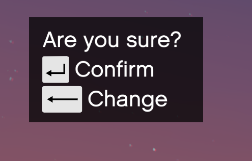
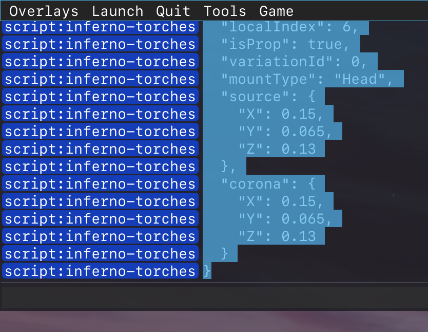

# Developers
The process for adding new presets for Peds and MP Peds is similar, and only deviates at the end.  
Follow the process below to create new Torch Presets.

### Enable the tool
To enable the tool, type the following command: `/torch tool`.

### Select the Mount Type
In the top left of your screen, the tool will prompt you to select from either a Chest or Head torch.


### Select Corona Position
Use the controls listed in the top left of your screen to move the gizmo to the position you want the corona to appear from.

|  |  |
|----------------------------------------------------|------------------------------------------------|

For example, this corona has been positioned in front of the head torch.

### Confirm Corona Position
Use the controls listed in the top left of your screen to confirm you are happy with the position of the corona.  
If not, you can go back and move it again.

|  |  |
|-------------------------------------------------|--------------------------------------------------|

:::tip
View the preview corona from multiple angles to ensure it is positioned correctly.  
If not, you can go back and move it again.
:::

### Select Light Source Position
Use the controls listed in the top left of your screen to move the gizmo to the position you want the light source to appear from.  
Generally, this will be the same as your Corona Position; however, sometimes due to clipping you may need to move the source further away from the ped.

|  |  |
|----------------------------------------------------|------------------------------------------------|

For example, this light source has been positioned in front of the head torch.

### Confirm Light Source Position
Use the controls listed in the top left of your screen to confirm you are happy with the position of the light source.  
If not, you can go back and move it again.

|  |  |
|-------------------------------------------------|--------------------------------------------------------|

:::tip
View the preview light source from multiple angles to ensure it is positioned correctly.  
If not, you can go back and move it again.
:::

### Select Cloth Type
:::note
This step is only for MP Peds; for Peds, skip to [this step](#copy-preset-json).
:::

Use the controls listed in the top left of your screen to select which cloth type to attach this preset to.

For example, if you're setting up a head torch for a specific helmet, you would select Prop.  
Another example, if you're setting up a chest torch for a specific jacket, you would select Component.


### Select Cloth Item
Use the controls listed in the top left of your screen to select which cloth item to attach this preset to.

Using the previous example, for a helmet torch, you would select `Hats / Helmets`.  
For the jacket torch, you would select `Shirt Overlay / Jacket`

|  |  |  |
|--------------------------------------------------|--------------------------|--------------------------------|

### Copy Preset JSON
After final confirmation, you will see this notification:


Press F8 to access your client console, there you will see JSON.  
For example, it may look like this:


Select all the JSON like you would select any other text.



After selecting it, copy it either by pressing `Ctrl` + `C`, or right-clicking in the console and selecting `Copy`.

You will now have something like this in your clipboard:

```json
{
  "collectionName": "mp_m_smuggler_01",
  "localIndex": 6,
  "isProp": true,
  "variationId": 0,
  "mountType": "Head",
  "source": {
    "X": 0.15,
    "Y": 0.065,
    "Z": 0.13
  },
  "corona": {
    "X": 0.15,
    "Y": 0.065,
    "Z": 0.13
  }
}
```

:::tip
Ped and MP Ped presets look slightly different, but the process is the same.
:::

### Adding Preset to Config
Open your `config.json` and locate the appropriate section.  
For Peds, this is the `peds` section.  
For MP Peds, this is the `mpped` section, and within that, either `male` or `female`.

Paste your new preset into the correct section, ensuring proper JSON syntax is used, or the config will break.

:::warning
JSON syntax is important: missing `,`s, `[]`s, etc. will break the file. Check your JSON syntax with [this website](https://jsonformatter.org/).
:::
