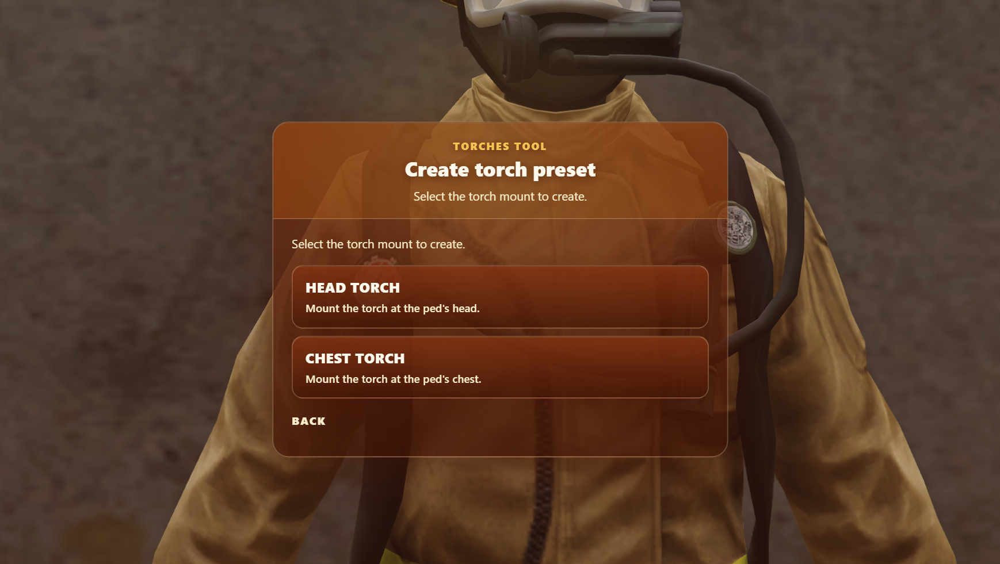
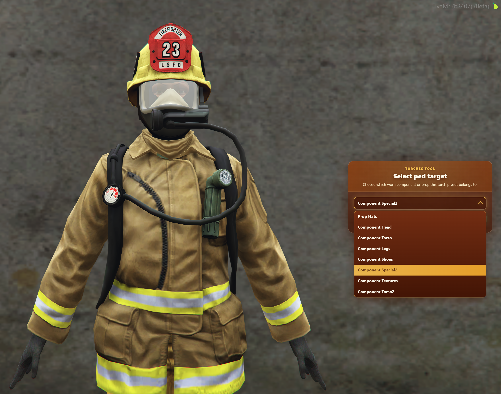
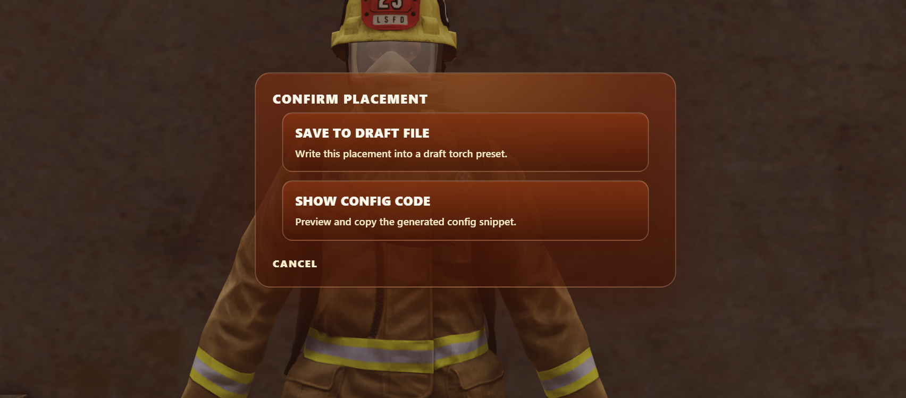

# Torch Tool

The Torch Tool is an in-game editor for creating and editing Ped and MP Ped torch presets. It guides you through selecting the torch mount, choosing the clothing or prop target, positioning the torch, and exporting or saving the finished preset.

The tool creates entries for [`torches.json`](../config.md#preset-files). You do not need to build the JSON by hand.

## Before You Start

1. Ensure you have the [`InfernoTorches.Tool`](../config.md#use-torch-tool) ACE permission.
2. Spawn the Ped or MP Ped you want to configure.
	- Pre-configure the Ped with the torch clothing component or prop already equipped when you want to create a component-specific preset.
3. Run `/torch tool`. If you changed [`ic_torches_command`](../config.md#command), replace `torch` with your configured command name.

:::note
The tool uses your current Ped. It can preview clothing and prop targets while you configure an MP Ped preset.
:::

## Create a New Preset

Select **Create new**, then choose the mount:

- **Head torch** - mounts the torch at the Ped's head.
- **Chest torch** - mounts the torch at the Ped's chest.

### Select the Target

For a regular Ped, decide whether the preset should match a specific clothing component:

- **Match component enabled** - select the component and drawable that the preset belongs to. The preset will only match that model when it is wearing the selected combination.
- **Match component disabled** - create a model-only preset. The preset will match the model regardless of its current clothing or drawable. This is useful for non-MP Peds whose torch position does not depend on their clothing.

For an MP Ped, select the clothing component or prop that the preset belongs to. The tool previews target selections on the current Ped so you can confirm the correct item before placing the torch.

### Place the Torch

After completing setup, select **Next** to enter placement mode. The editor opens a camera and a 3D world gizmo around the selected Ped.

Drag an axis on the world gizmo to move the torch along that direction. Drag the centre handle to move it across the visible placement plane. Select **Reset gizmo position** to restore the default head or chest position.

### Control the Camera

Use the placement camera to inspect the torch from different angles:

- **Move:** hold the right mouse button and move the mouse.
- **Rotate:** hold the middle mouse button and move the mouse.
- **Zoom:** use the scroll wheel.
- **Direction snapping:** select a direction on the camera gizmo.
- **Recenter:** select **Recenter** to return the camera to its default view.

The camera transitions smoothly between snapped views and returns to gameplay when the tool closes.

## Confirm the Preset

Select **Confirm placement** when the torch is correctly positioned. Choose one of the following options:

- **Save to draft file** - saves the preset server-side in `draft-torches.json`.
- **Show config code** - displays the generated JSON and provides a copy button.

If a matching preset already exists, choose **Replace existing** to overwrite it.

:::warning
`draft-torches.json` is a working file. Review the generated preset and copy it into the appropriate `peds` or `mppeds` collection in `torches.json` before using it as a live preset.
:::

## Edit an Existing Preset

Select **Edit existing** from the opening screen. The tool searches both the live and draft preset files for matching entries for the current Ped.

Select a preset to load it, then update its target, mount, and placement just as you would when creating a new preset. For a non-MP preset, the **Match component** option reflects whether the loaded preset is model-only or component-specific. When editing an MP Ped preset, the tool can update the current Ped's clothing or prop to match the selected preset.

## Troubleshooting

### I cannot open the tool

Confirm that you have the [`InfernoTorches.Tool`](../config.md#use-torch-tool) ACE permission and that the resource configuration has been executed with `exec @inferno-torches/config.cfg`.

### No matching preset is found

Confirm that the current Ped model, mount type, and preset file entry match. For a component-specific non-MP preset, also confirm that the current component and drawable match. If you want a non-MP preset to work across clothing variations, edit it with **Match component** disabled. If you want all Peds to be able to use torches without a matching preset, enable [`ic_torches_allowAnyPed`](../config.md#allow-any-ped).

### My saved preset is not active in-game

Drafts are saved to `draft-torches.json`, not the live `torches.json` file. Copy the reviewed preset into `torches.json` and restart the resource.
