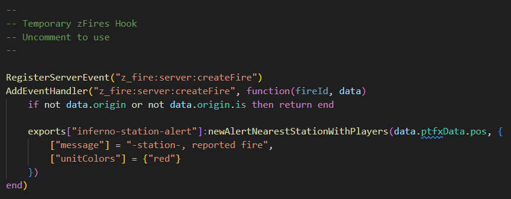
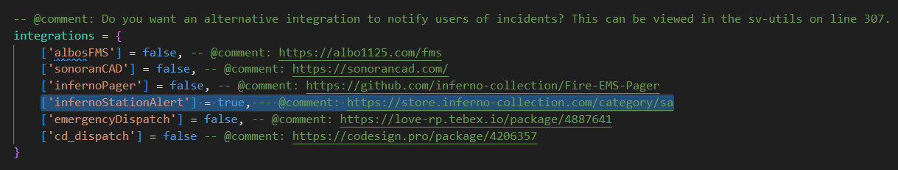
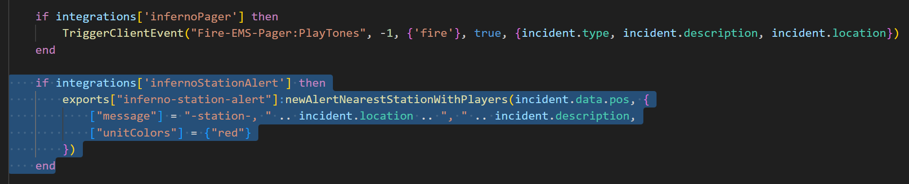
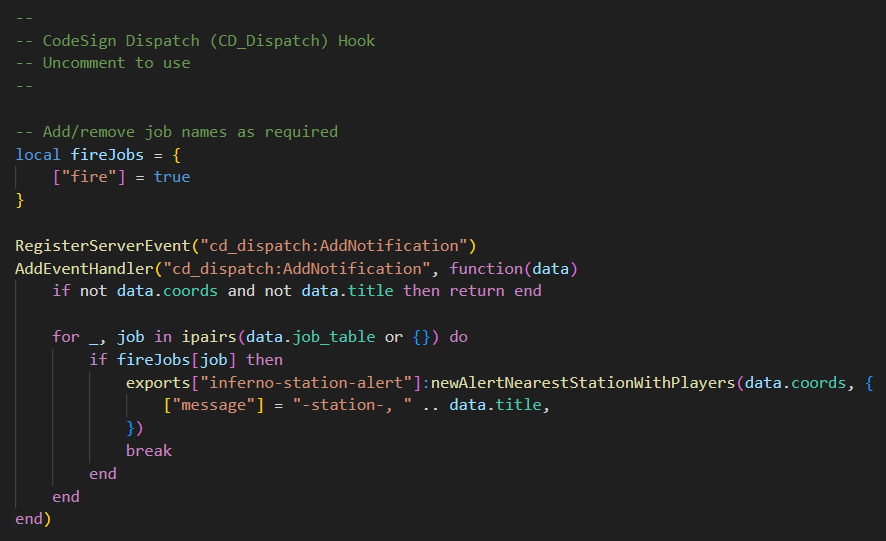
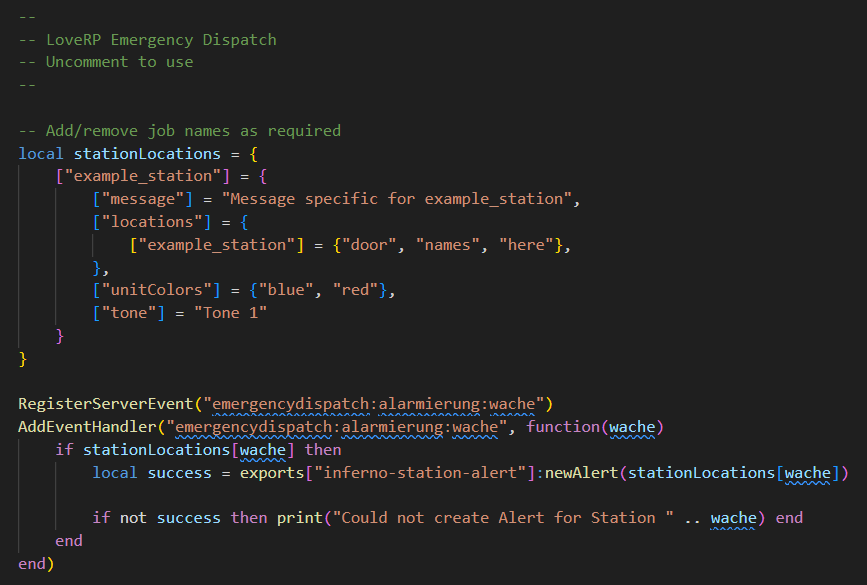
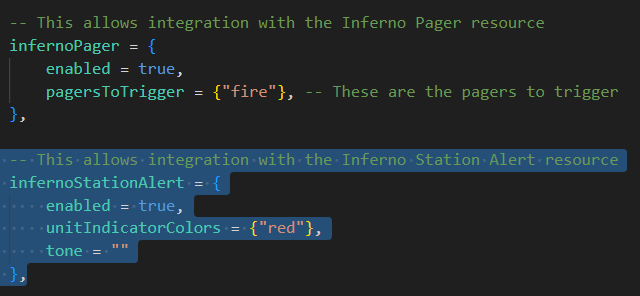
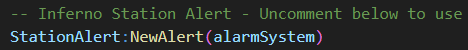

# Third-Party Resources
This page explains how to integrate SA with third-party resources.

:::tip
Third-Party Resource Integrations only work with the [Standalone Version](../index.md#station-alert-1) of SA.
:::

## zFires
Follow the steps below to create alerts when a player started fire is created, and when automatic incidents are created.

1. Inside `inferno-station-alert`, open `editable/server/events.lua`.
2. Locate the `Temporary zFires Hook`, then uncomment (remove the `--`) the section below.

3. Inside `z_fire`, open `core/config.lua`.
4. Locate `integrations = {...}`, then add the following under `['infernoPager'] = ...`:
	```lua
	['infernoStationAlert'] = true, -- @comment: https://store.inferno-collection.com/category/sa
	```
	
5. Inside `z_fire`, open `core/server/classes/utils.lua`.
6. Locate `if integrations['infernoPager'] then`, then add the following underneath:
	```lua
 	if integrations['infernoStationAlert'] then
        exports["inferno-station-alert"]:newAlertNearestStationWithPlayers(incident.data.pos, {
            ["message"] = "-station-, " .. incident.location .. ", " .. incident.description,
            ["unitColors"] = {"red"}
        })
    end
	```
 	

You can customize the `exports` to liking, see [here](exports/server.md) for more information.

:::note
In a future update of zFires, this code will be added as part of the zFires download - beware of duplication when updating.
:::

## CD_Dispatch
Follow the steps below to create alerts when a new notification is created for one or more specific jobs.

1. Inside `inferno-station-alert`, open `editable/server/events.lua`.
2. Locate the `CodeSign Dispatch (CD_Dispatch) Hook`, then uncomment (remove the `--`) the section below.
   
3. Update `fireJobs` with the names of jobs you would like to use for alerts.

You can customize the `exports` to liking, see [here](exports/server.md) for more information.

## Emergency Dispatch
Follow the steps below to create alerts when a new notification is created for one or more specific stations.

1. Inside `inferno-station-alert`, open `editable/server/events.lua`.
2. Locate the `LoveRP Emergency Dispatch`, then uncomment (remove the `--`) the section below.
   
3. Update `stationLocations` as you wish.

You can customize the `exports` to liking, see [here](exports/server.md) for more information.

## Smart Fires
Follow the steps below to create alerts when a player started fire is created, and when automatic fires are created.

1. Inside `SmartFires`, open `config.lua`.
2. Locate `infernoStationAlert = {...}`, and set `enabled` to `true`, then edit `unitIndicatorColors` and `tone` as you wish.
   
   - Leaving `tone` empty will use the default tone.
   - Set `unitIndicatorColors` to `{}` to not have any colors.

You can customize the `exports` to liking, see [here](exports/server.md) for more information.

## Fire Alarm Reborn
Follow the steps below to create alerts when a fire alarm is activated.

1. Inside `inferno-fire-alarm-reborn`, open `editable/server/events.lua`.
2. Locate the `Inferno Station Alert - Uncomment below to use`, then uncomment (remove the `--`) the section below.
   

You can customize the `exports` to liking by editing `editables/server/station-alert.lua`. For more information on `exports`, see [here](exports/server.md).
