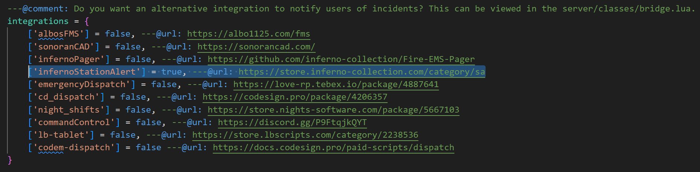

# Third-Party Resources
This page explains how to integrate SA with third-party resources.

:::tip
Third-Party Resource Integrations only work with the [Standalone Version](../index.md#station-alert-1) of SA.
:::

## zFires
Follow the steps below to create alerts when a player started fire is created, and when automatic incidents are created.

1. Inside `z_fire`, open `core/config.lua`.
2. Locate `integrations = {...}`, then find `['infernoStationAlert'] = false` and change to `true`.
    

You can customize the `exports` to liking, see [here](exports/server.md) for more information.

## CD_Dispatch
Follow the steps below to create alerts when a new notification is created for one or more specific jobs.

1. Inside `inferno-station-alert`, open `editable/server/events.lua`.
2. Locate the `CodeSign Dispatch (CD_Dispatch) Hook`, then uncomment (remove the `--`) the section below.
   
3. Update `fireJobs` with the names of jobs you would like to use for alerts.

You can customize the `exports` to liking, see [here](exports/server.md) for more information.

## Emergency Dispatch
Follow the steps below to create alerts when a new notification is created for one or more specific stations.

1. Inside `inferno-station-alert`, open `editable/server/events.lua`.
2. Locate the `LoveRP Emergency Dispatch`, then uncomment (remove the `--`) the section below.
   
3. Update `stationLocations` as you wish.

You can customize the `exports` to liking, see [here](exports/server.md) for more information.

## Smart Fires
Follow the steps below to create alerts when a player started fire is created, and when automatic fires are created.

1. Inside `SmartFires`, open `config.lua`.
2. Locate `infernoStationAlert = {...}`, and set `enabled` to `true`, then edit `unitIndicatorColors` and `tone` as you wish.
   
   - Leaving `tone` empty will use the default tone.
   - Set `unitIndicatorColors` to `{}` to not have any colors.

You can customize the `exports` to liking, see [here](exports/server.md) for more information.

## Fire Alarm Reborn
Follow the steps below to create alerts when a fire alarm is activated.

1. Inside `inferno-fire-alarm-reborn`, open `editable/server/events.lua`.
2. Locate the `Inferno Station Alert - Uncomment below to use`, then uncomment (remove the `--`) the section below.
   

You can customize the `exports` to liking by editing `editables/server/station-alert.lua`. For more information on `exports`, see [here](exports/server.md).


## Sonoran CAD
To connect Sonoran CAD and Inferno Collection, ensure that Sonoran CAD starts before SA does.  
When SA connects with Sonoran CAD, you will see a log entry in the console:

```
Sonoran CAD detected
```
