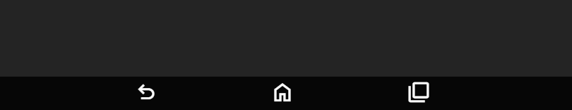

# Applications

Applications, or Apps, are interfaces that can be added to the tablet.
Applications are added to the Tablet home screen and can be interacted with by players.

## Creating applications

Creating applications is easy, each application is given its own [iframe](https://developer.mozilla.org/en-US/docs/Web/HTML/Element/iframe) which allows full control over the content within it.

Create your App HTML file, for example `notes.html` and add it as `file` to your [resource manifest](https://docs.fivem.net/docs/scripting-reference/resource-manifest/resource-manifest/). This file will later be registered as your application.

```lua
fx_version 'cerulean'

file 'notes.html'
```

:::tip
We recommend not calling the file `index.html`, `nui.html`, `dui.html`, etc., as this can become confusing if your App ends up requiring multiple files/pages.
:::

## Registering applications

Each application must be registered, this can be done by calling the `registerApplication` export on the client.

```lua
exports['inferno-tablet']:registerApplication({
    name = 'notes',
    displayName = 'Notes',

    filePath = '/notes.html',
    iconUrl = '/imgs/icon.png'
    primaryColor = '#FB922B'
})
```

See the table below for more information about each field.

| Name               | Description                                                                   | Required | Default Value |
|--------------------|-------------------------------------------------------------------------------|----------|---------------|
| `name`             | The name of the application, this must only contain alphanumeric characters.  | ✅        | N/A           |
| `displayName`      | The display name of the application, this one is shown to the user.           | ✅        | N/A           |
| `filePath`         | The relative path to your application HTML file in the resource.              | ✅        | N/A           |
| `iconUrl`          | The relative path to your application icon, this is shown on the home screen. | ✅        | N/A           |
| `primaryColor`     | The primary color of your application.                                        | ✅        | N/A           |
| `manualNavigation` | Whether manual navigation has been enabled.                                   | ❌        | `false`       |

## Navigation

The tablet features navigation buttons for the user to navigate, for example the home button will close the app and return to the home screen.



The action of the back button depends on whether manual navigation has been enabled. When manual navigation is disabled the back button will use the normal navigation of the browser and go back in history, if there is no history it will return to the home screen.

When manual navigation has been enabled the tablet will receive [back messages](messages.md#onback) when the back button has been pressed.