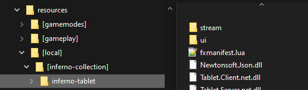

# Installation

Installing the tablet is a straightforward process, releases are provided for easy installation.

## Getting the latest release

Browse to the [releases](https://github.com/inferno-collection/Tablet/releases) page, on the latest release download the `Inferno-Tablet-[...].zip` file.


## Adding the resource

Open the ZIP file and extract the `[inferno-collection]` folder to your resources folder.



Now add the resource to startup by adding the following line to your `server.cfg` file.

```
ensure [inferno-collection]
```

Restart your server and you're ready to go!
