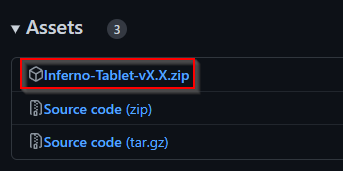
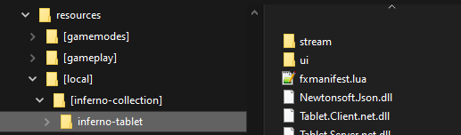

# Installation

Installing the tablet is a straightforward process, releases are provided for easy installation.

## Downloading the latest release

Browse to the [releases page](https://github.com/inferno-collection/Tablet/releases/latest), find the latest release, and download the `Inferno-Tablet-[...].zip` file.



:::caution
Do not download the `Source code (zip/tar.gz)` files. Inferno Tablet is a C# resource, downloading these files will require you to manually compile to code before being able to use it.
:::

## Extracting the files

Open the ZIP file and extract the `[inferno-collection]` folder to your resources folder.



:::tip
If you already have an `[inferno-collection]` folder, simply merge the old one with the new one.
:::

## Editing the `server.cfg`

Add the following line to your `server.cfg` file:

```
ensure [inferno-collection]
```

:::info
If you have other Inferno Collection resources already installed in your server, this line may already be in your `server.cfg`; you do not need to add it again.
:::

Restart your server and you're ready to go!
